---
## Front matter
lang: ru-RU
title: Лабораторная работа №1
subtitle: Операционные системы
author:
  - Кузьмин Егор Витальевич, НКАбд-03-23
institute:
  - Российский университет дружбы народов, Москва, Россия
date: 27 февраля 2024

## i18n babel
babel-lang: russian
babel-otherlangs: english

## Formatting pdf
toc: false
toc-title: Содержание
slide_level: 2
aspectratio: 169
section-titles: true
theme: metropolis
header-includes:
 - \metroset{progressbar=frametitle,sectionpage=progressbar,numbering=fraction}
 - '\makeatletter'
 - '\beamer@ignorenonframefalse'
 - '\makeatother'

## font
mainfont: PT Serif
romanfont: PT Serif
sansfont: PT Sans
monofont: PT Mono
mainfontoptions: Ligatures=TeX
romanfontoptions: Ligatures=TeX
sansfontoptions: Ligatures=TeX,Scale=MatchLowercase
monofontoptions: Scale=MatchLowercase,Scale=0.9
---

## Цель работы

  Целью данной работы является приобретение практических навыков настройки минимально необходимых сервисов для дальнейшей работы.
  
## Задание

 0. Первичное ознакомление с заданием.
 1. Создание виртуальной машины.
 2. Установка операционной системы.
 3. Работа с операционной системой после установки.
 4. Установка программного обеспечения для создания документации.
 5. Дополнительные задания.

## Создание виртуальной машины

 У меня уже был установлен VirtualBox и создана виртуальная машина во время выполнения заданий курса прошлого семестра, поэтому данный этап я пропускаю

## Установка операционной системы

 По аналогичным причинам я не буду заниматься установкой операционной системы

## Работа с операционной системой после установки

 Вхожу в ОС под заданной мной при установке учетной записью, запускаю терминал и переключаюсь на роль супер-пользователя, обновляю все пакеты (рис. 1).

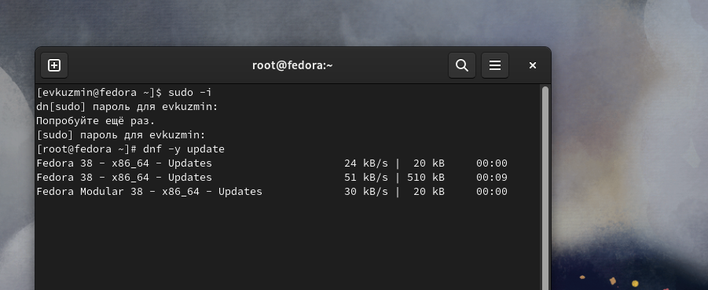{#fig:001 width=70%}

## Работа с операционной системой после установки

 Устанавливаю программы для удобства работы в консоли: tmux для открытия нескольких вкладок в одном терминале (рис. 2).

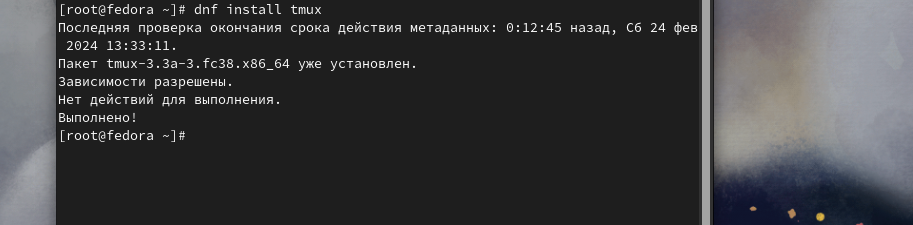{#fig:002 width=70%}

## Работа с операционной системой после установки

 Перемещаюсь в директорию /etc/selinux, открываю mс, ищу нужный файл (рис. 3).

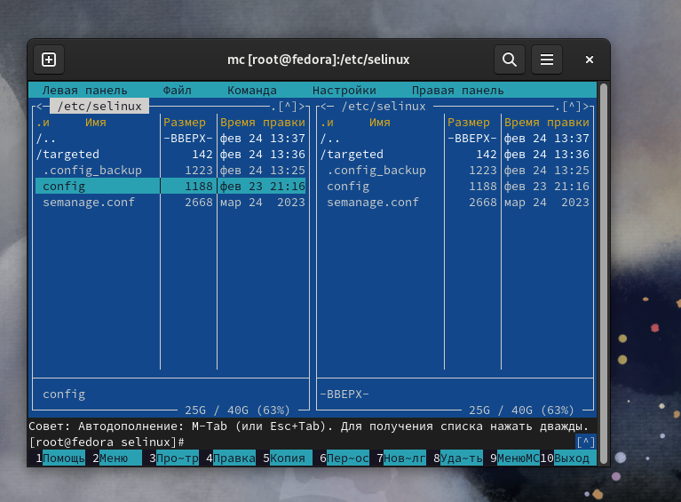{#fig:003 width=70%}

## Работа с операционной системой после установки

 - Изменяю открытый файл: SELINUX=enforcing меняю на значение SELINUX=permissive (рис 4).
 - Перезагружаю виртуальную машину

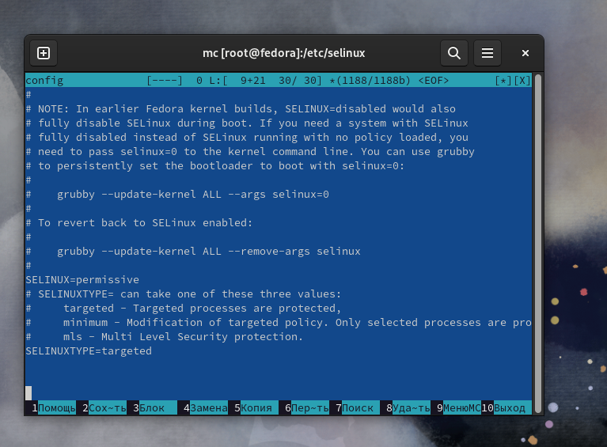{#fig:004 width=70%}

## Работа с операционной системой после установки

 - Снова вхожу в ОС, снова запускаю терминал, запускаю терминальный мультиплексор
 - Переключаюсь на роль супер-пользователя
 - Устанавливаю пакет DevelopmentTools (рис. 5).

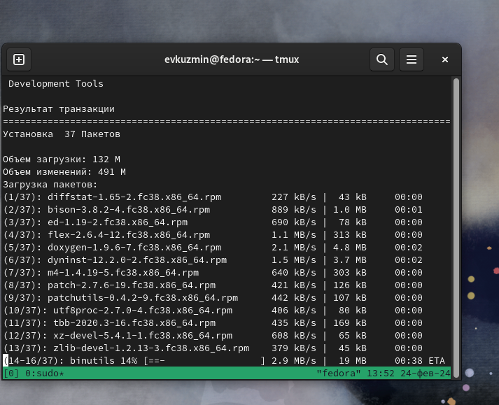{#fig:005 width=70%}

## Работа с операционной системой после установки

 Устанавливаю пакет dkms (рис. 6).

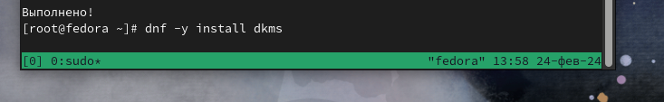{#fig:006 width=70%}

## Работа с операционной системой после установки

 - В меню виртуальной машины подключаю образ диска гостевой ОС и примонтирую диск с помощью утилиты mount
 - Устанавливаю драйвера 
 - В очередной раз перезагружаю виртуальную машину (рис. 7).

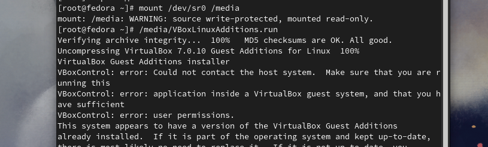{#fig:007 width=70%}

## Работа с операционной системой после установки

 - Перехожу в директорию /tc/X11/xorg.conf.d, открываю mc для удобства, открываю файл конфига
 - Редактирую конфигурационный файл 
 - Перезагружаю виртуальную машину (рис. 8).

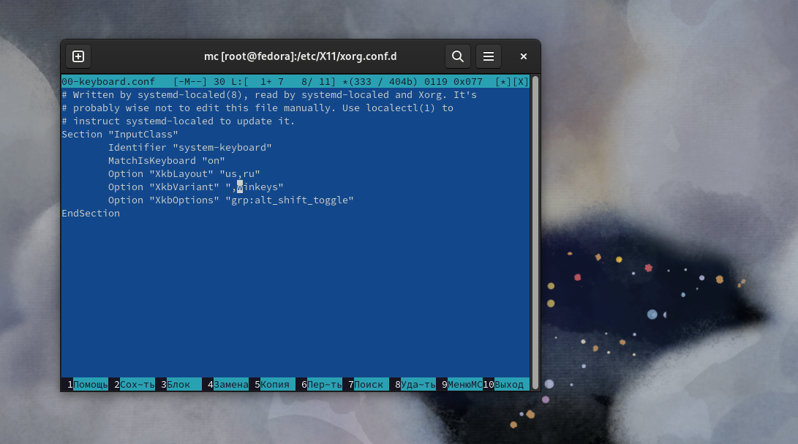{#fig:008 width=70%}

## Установка программного обеспечения для создания документации

 - Запускаю терминал. 
 - Запускаю терминальный мультиплексор tmux,
 - Переключаюсь на роль супер-пользователя
 - Устанавливаю pandoc с помощью утилиты dnf (рис. 9).

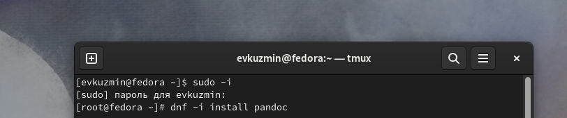{#fig:009 width=70%}

## Установка программного обеспечения для создания документации

 Устанавливаю дистрибутив texlive (рис. 10).

{#fig:010 width=70%}

## Выводы

 При выполнении данной лабораторной работы я приобрел практические навыки по настройке минимально необходимых для дальнейшей работы сервисов.

## Выполнение дополнительного задания

 Ввожу в терминале команду dmesg, чтобы проанализировать последовательность загрузки системы (рис. 11).

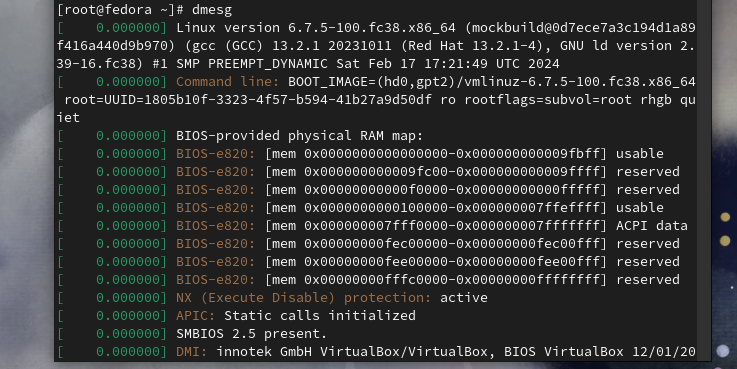{#fig:011 width=70%}

## Выполнение дополнительного задания

 Ищу версию ядра Linux (рис. 12).

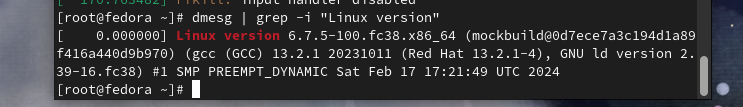{#fig:012 width=70%}

## Выполнение дополнительного задания

 Оставляем одно из ключевых слов и получаем результат (рис. 13).

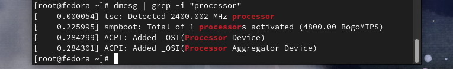{#fig:013 width=70%}

## Выполнение дополнительного задания

 Аналогично ищу модель процессора (рис. 14).

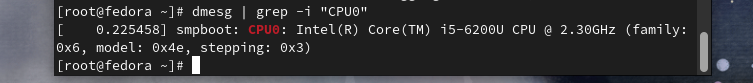{#fig:014 width=70%}

## Выполнение дополнительного задания

 Объем доступной оперативной памяти ищу аналогично поиску частоты процессора (рис. 15).

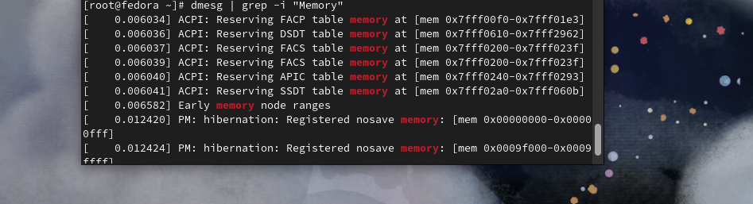{#fig:015 width=70%}

## Выполнение дополнительного задания

 Нахожу тип обнаруженного гипервизора (рис. 16).

{#fig:016 width=70%}

## Выполнение дополнительного задания

 Тип файловой системы корневого раздела можно посомтреть с помощью утилиты fdisk (рис. 17).

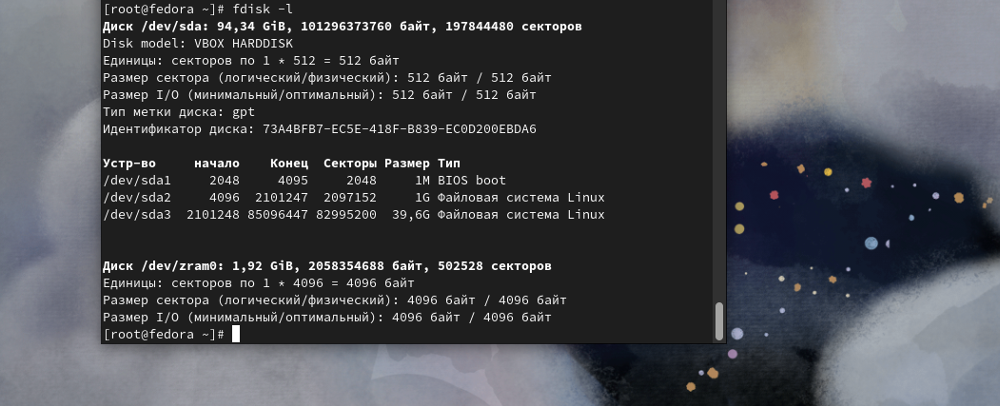{#fig:017 width=70%}

## Выполнение дополнительного задания

 Последовательность монтирования файловых систем можно посмотреть, введя в поиск по результату dmesg слово mount (рис. 18).

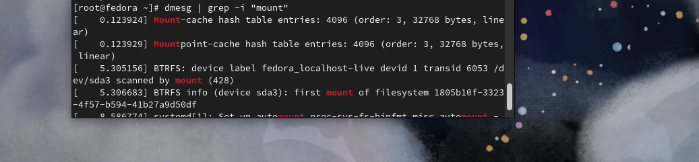{#fig:018 width=70%}

## Список литературы{.unnumbered}

 [Архитектура компьютеров и ОС/Электронный ресурс](https://esystem.rudn.ru/mod/page/view.php?id=1098787)

