---
## Front matter
title: "Отчет по лабораторной работе №1"
subtitle: "Операционные системы"
author: "Кузьмин Егор Витальевич"

## Generic otions
lang: ru-RU
toc-title: "Содержание"

## Bibliography
bibliography: bib/cite.bib
csl: pandoc/csl/gost-r-7-0-5-2008-numeric.csl

## Pdf output format
toc: true # Table of contents
toc-depth: 2
lof: true # List of figures
lot: true # List of tables
fontsize: 12pt
linestretch: 1.5
papersize: a4
documentclass: scrreprt
## I18n polyglossia
polyglossia-lang:
  name: russian
  options:
	- spelling=modern
	- babelshorthands=true
polyglossia-otherlangs:
  name: english
## I18n babel
babel-lang: russian
babel-otherlangs: english
## Fonts
mainfont: PT Serif
romanfont: PT Serif
sansfont: PT Sans
monofont: PT Mono
mainfontoptions: Ligatures=TeX
romanfontoptions: Ligatures=TeX
sansfontoptions: Ligatures=TeX,Scale=MatchLowercase
monofontoptions: Scale=MatchLowercase,Scale=0.9
## Biblatex
biblatex: true
biblio-style: "gost-numeric"
biblatexoptions:
  - parentracker=true
  - backend=biber
  - hyperref=auto
  - language=auto
  - autolang=other*
  - citestyle=gost-numeric
## Pandoc-crossref LaTeX customization
figureTitle: "Рис."
tableTitle: "Таблица"
listingTitle: "Листинг"
lofTitle: "Список иллюстраций"
lotTitle: "Список таблиц"
lolTitle: "Листинги"
## Misc options
indent: true
header-includes:
  - \usepackage{indentfirst}
  - \usepackage{float} # keep figures where there are in the text
  - \floatplacement{figure}{H} # keep figures where there are in the text
---

# Цель работы

 Целью данной работы является приобретение практических навыков настройки минимально необходимых сервисов для дальнейшей работы.

# Задание

 0. Первичное ознакомление с заданием.
 1. Создание виртуальной машины.
 2. Установка операционной системы.
 3. Работа с операционной системой после установки.
 4. Установка программного обеспечения для создания документации.
 5. Дополнительные задания.

# Выполнение лабораторной работы

## Создание виртуальной машины

 У меня уже был установление VirtualBox и создана виртуальная машина во время выполнения заданий курса прошлого семестра, поэтому данный этап я пропускаю

## Установка операционной системы

 По аналогичным причинам я не буду заниматься установкой операционной системы

## Работа с операционной системой после установки

 Вхожу в ОС под заданной мной при установке учетной записью, запускаю терминал и переключаюсь на роль супер-пользователя, обновляю все пакеты (рис. 1).

{#fig:001 width=70%}

 Устанавливаю программы для удобства работы в консоли: tmux для открытия нескольких вкладок в одном терминале (рис. 2).

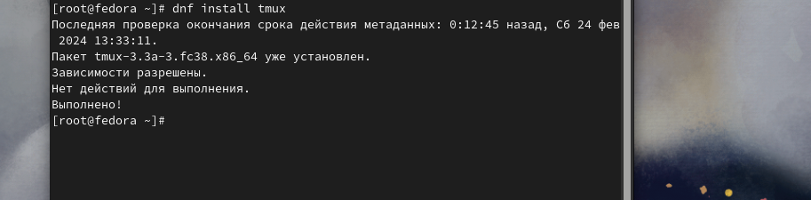{#fig:002 width=70%}

 Перемещаюсь в директорию /etc/selinux, открываю mс, ищу нужный файл (рис. 3).

{#fig:003 width=70%}

 Изменяю открытый файл: SELINUX=enforcing меняю на значение SELINUX=permissive (рис 4).

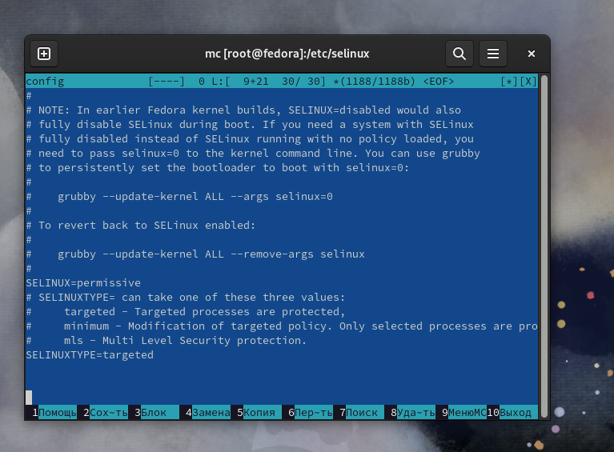{#fig:004 width=70%}

 Перезагружаю виртуальную машину (рис. 5).

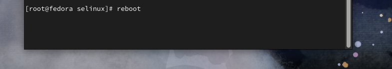{#fig:005 width=70%}

 Снова вхожу в ОС, снова запускаю терминал, запускаю терминальный мультиплексор (рис 6).

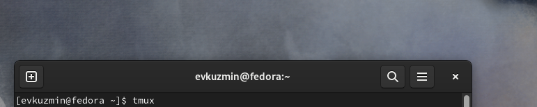{#fig:006 width=70%}

 Переключаюсь на роль супер-пользователя (рис. 7).

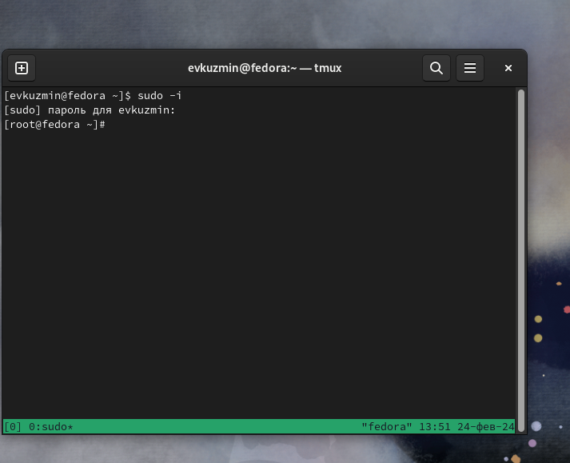{#fig:007 width=70%}

 Устанавливаю пакет DevelopmentTools (рис. 8).

{#fig:008 width=70%}

 Устанавливаю пакет dkms (рис. 9).

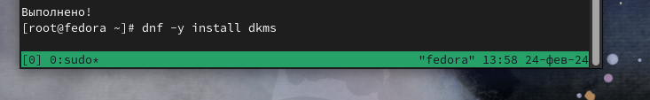{#fig:009 width=70%}

 В меню виртуальной машины подключаю образ диска гостевой ОС и примонтирую диск с помощью утилиты mount, устанавливаю драйвера (рис. 11).

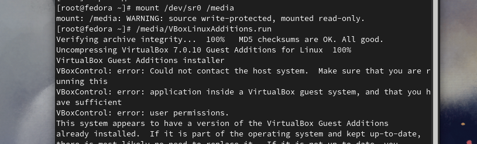{#fig:011 width=70%}

 В очередной раз перезагружаю виртуальную машину

 Перехожу в директорию /tc/X11/xorg.conf.d, открываю mc для удобства, открываю файл 00-keyboard.conf (рис. 12).

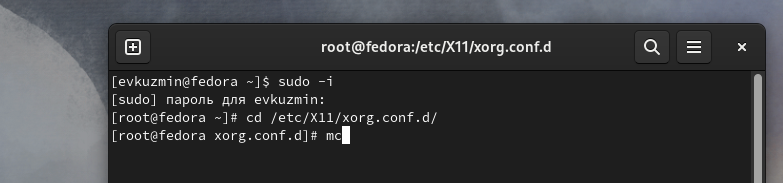{#fig:012 width=70%}

 Редактирую конфигурационный файл (рис. 13).

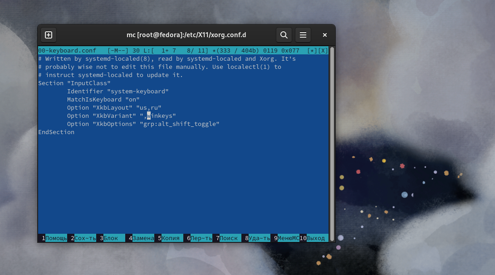{#fig:013 width=70%}

 Перезагружаю виртуальную машину (рис. 014).

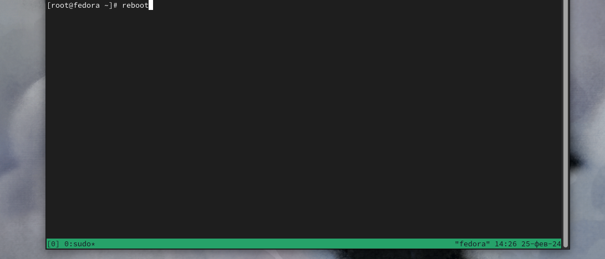{#fig:014 width=70%}

## Установка программного обеспечения для создания документации

 Запускаю терминал. Запускаю терминальный мультиплексор tmux, переключаюсь на роль супер-пользователя. Устанавливаю pandoc с помощью утилиты dnf (рис. 15).

{#fig:015 width=70%}

 Устанавливаю дистрибутив texlive (рис. 16).

{#fig:016 width=70%}

# Выводы

 При выполнении данной лабораторной работы я приобрел практические навыки по настройке минимально необходимых для дальнейшей работы сервисов.

# Ответы на контрольные вопросы

 1. Учетная запись содержит необходимые для идентификации пользователя при подключении к системе данные, а так же информацию для авторизации и учета: системного имени (user name) (оно может содержать только латинские буквы и знак нижнее подчеркивание, еще оно должно быть уникальным), идентификатор пользователя (UID) (уникальный идентификатор пользователя в системе, целое положительное число), идентификатор группы (CID) (группа, к к-рой относится пользователь. Она, как минимум, одна, по умолчанию - одна), полное имя (full name) (Могут быть ФИО), домашний каталог (home directory) (каталог, в к-рый попадает пользователь после входа в систему и в к-ром хранятся его данные), начальная оболочка (login shell) (командная оболочка, к-рая запускается при входе в систему).

 2. Для получения справки по команде: <команда> --help; для перемещения по файловой системе - cd; для просмотра содержимого каталога - ls; для определения объёма каталога - du <имя каталога>; для создания / удаления каталогов - mkdir/rmdir; для создания / удаления файлов - touch/rm; для задания определённых прав на файл / каталог - chmod; для просмотра истории команд - history

 3. Файловая система - это порядок, определяющий способ организации и хранения и именования данных на различных носителях информации. Примеры: FAT32 представляет собой пространство, разделенное на три части: олна область для служебных структур, форма указателей в виде таблиц и зона для хранения самих файлов. ext3/ext4 - журналируемая файловая система, используемая в основном в ОС с ядром Linux.

 4. С помощью команды df, введя ее в терминале. Это утилита, которая показывает список всех файловых систем по именам устройств, сообщает их размер и данные о памяти. Также посмотреть подмонтированные файловые системы можно с помощью утилиты mount.

 5. Чтобы удалить зависший процесс, вначале мы должны узнать, какой у него id: используем команду ps. Далее в терминале вводим команду kill < id процесса >. Или можно использовать утилиту killall, что "убьет" все процессы, которые есть в данный момент, для этого не нужно знать id процесса.

# Выполнение задания

 Ввожу в терминале команду dmesg, чтобы проанализировать последовательность загрузки системы (рис. 17).

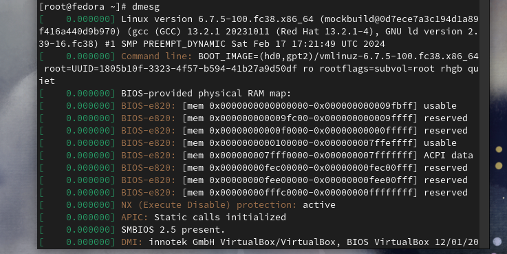{#fig:017 width=70%}

 С помощью поиска, осуществляемого командой 'dmesg | grep -i <что ищем>', ищу версию ядра Linux (рис. 18).

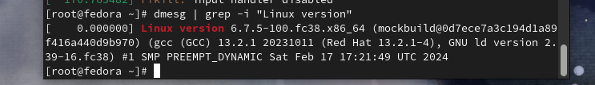{#fig:018 width=70%}

 Если вводить "Detected Mhz processor", то мне ничего не выведется. Это происходит потому, что запрос не предусматривает дополнительные символы внутри него. В таком случае оставляем одно из ключевых слов и получаем результат (рис. 19).

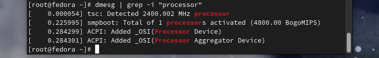{#fig:019 width=70%}

 Аналогично ищу модель процессора (рис. 20).

{#fig:020 width=70%}

 Объем доступной оперативной памяти ищу аналогично поиску частоты процессора, т. к. возникла та же проблема, что и там (рис. 21).

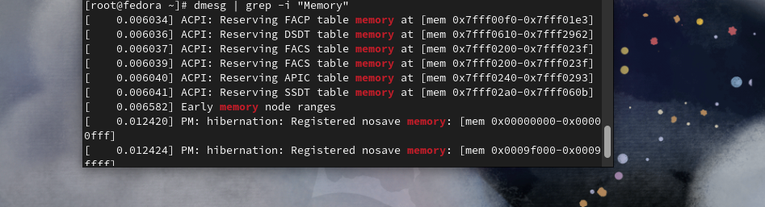{#fig:021 width=70%}

 Нахожу тип обнаруженного гипервизора (рис. 22).

{#fig:022 width=70%}

 Тип файловой системы корневого раздела можно посомтреть с помощью утилиты fdisk (рис. 23).

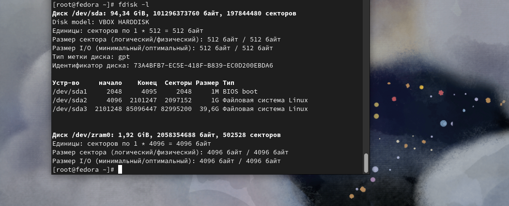{#fig:023 width=70%}

Последовательность монтирования файловых систем можно посмотреть, введя в поиск по результату dmesg слово mount (рис. 24).

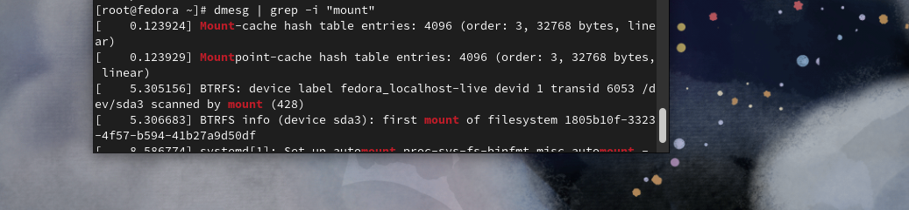{#fig:024 width=70%}

# Список литературы{.unnumbered}

 [Архитектура компьютеров и ОС/Электронный ресурс](https://esystem.rudn.ru/mod/page/view.php?id=1098787)

