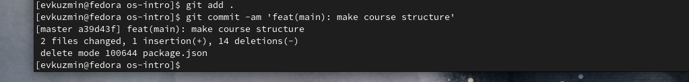

---
## Front matter
lang: ru-RU
title: Лабораторная работа №2
subtitle: Операционные системы
author:
  - Кузьмин Егор Витальевич, НКАбд-03-23
institute:
  - Российский университет дружбы народов, Москва, Россия
date: 27 февраля 2024

## i18n babel
babel-lang: russian
babel-otherlangs: english

## Formatting pdf
toc: false
toc-title: Содержание
slide_level: 2
aspectratio: 169
section-titles: true
theme: metropolis
header-includes:
 - \metroset{progressbar=frametitle,sectionpage=progressbar,numbering=fraction}
 - '\makeatletter'
 - '\beamer@ignorenonframefalse'
 - '\makeatother'

## font 
mainfont: PT Serif
romanfont: PT Serif
sansfont: PT Sans
monofont: PT Mono
mainfontoptions: Ligatures=TeX
romanfontoptions: Ligatures=TeX
sansfontoptions: Ligatures=TeX,Scale=MatchLowercase
monofontoptions: Scale=MatchLowercase,Scale=0.9
---

## Цель работы

  Целью данной лабораторной работы является изучение идеологии и получение практических навыков в применении средств контроля версий и работе с git.

## Задание

  0. Базовое ознакомление с git
  1. Создать базовую конфигурацию для работы с git
  2. Создать ключ SSH
  3. Создать ключ GPG
  4. Настроить подписи Git
  5. Заргеистрироваться на GitHub
  6. Создать локальный каталог для выполнения заданий по предмету.

## Выполнение лабораторной работы. Установка ПО.

Устанавливаю необходимое программное обеспечение git и gh (рис. 1).

{#fig:001 width=70%}

## Выполнение лабораторной работы. Базовая настройка git

 Настраивание конфига git (рис. 2).

{#fig:002 width=70%}

## Выполнение лабораторной работы. Создание ключа SSH

 Создаю ключ ssh размером 4096 бит по алгоритму rsa (рис. 3).

{#fig:003 width=70%}

## Выполнение лабораторной работы. Создание ключа SSH

 Создаю ключ ssh по алгоритму ed25519 (рис. 4).

{#fig:004 width=70%}

## Выполнение лабораторной работы. Создание ключа GPG

 Генерирую ключ GPG, затем выбираю тип ключа RSA, задаю максиммальную длину ключа: 4096, выбираю неограниченный срок действия ключа. Завершаем настройку (рис. 5).

{#fig:005 width=70%}

## Выполнение лабораторной работы. Регистрация на Github

 У меня уже был создан аккаунт на Github, соответственно просто вхожу в свой аккаунт.

## Выполнение лабораторной работы. Добавление ключа GPG в Github

 - Вывожу список созданных ключей в терминал
 - Ищу в результате запроса отпечаток ключа
 - Копирую его в буфер обмена
 - Ввожу в терминале команду, с помощью которой копирую сам ключ GPG в буфер обмена (рис. 6).

{#fig:006 width=70%}

## Выполнение лабораторной работы. Добавление ключа GPG в Github

 Мы видим добавленный ключ GPG на GitHub (рис. 7}.

{#fig:007 width=70%}

## Выполнение лабораторной работы. Настроить подписи Git

 Настраиваю автоматические подписи коммитов git (рис. 8).

{#fig:008 width=70%}

## Выполнение лабораторной работы. Настройка gh

 - Начинаю авторизацию в gh
 - Отвечаю на вопросы
 - В конце выбираю авторизоваться через браузер (рис. 9).

{#fig:009 width=70%}

## Выполнение лабораторной работы. Настройка gh

 Завершаю авторизацию на сайте (рис. 10).

{#fig:010 width=70%}

## Выполнение лабораторной работы. Создание репозитория курса на основе шаблона

 - Создаю директорию с помощью утилиты mkdir
 - Перехожу в созданную директорию
 - Создаю репозиторий
 - После этого клонирую репозиторий к себе в директорию (рис. 11).

{#fig:011 width=70%}

## Выполнение лабораторной работы. Создание репозитория курса на основе шаблона

 - Перехожу в каталог курса
 - Проверяю содержание каталога 
 - Удаляю лишние файлы
 - Создаю необходимые каталоги, используя makefile 
 - Сохраняю добавленные изменения
 - Комментирую их с помощью git commit (рис. 12).

{#fig:012 width=70%}

## Выполнение лабораторной работы. Создание репозитория курса на основе шаблона

 Отправляю файлы на сервер с помощью git push (рис. 013).

{#fig:013 width=70%}

## Выводы

  При выполнении данной лабораторной работы я приобрел практические навыки по применению средств контроля версий и работе с git.

## Список литературы{.unnumbered}

  [Архитектура компьютеров и ОС/Электронный ресурс](https://esystem.rudn.ru/mod/page/view.php?id=1098790)
