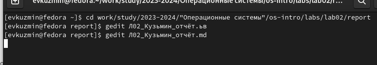
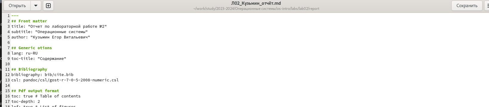
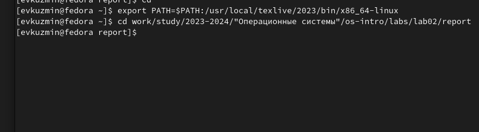
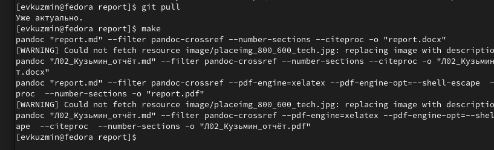
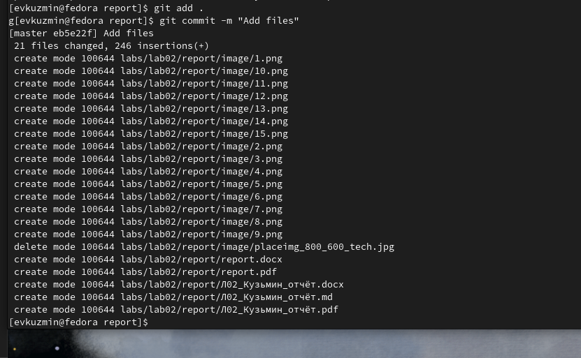

---
## Front matter
lang: ru-RU
title: Лабораторная работа №3
subtitle: Операционные системы
author:
  - Кузьмин Егор Витальевич, НКАбд-03-23
institute:
  - Российский университет дружбы народов, Москва, Россия
date: 27 февраля 2024

## i18n babel
babel-lang: russian
babel-otherlangs: english

## Formatting pdf
toc: false
toc-title: Содержание
slide_level: 2
aspectratio: 169
section-titles: true
theme: metropolis
header-includes:
 - \metroset{progressbar=frametitle,sectionpage=progressbar,numbering=fraction}
 - '\makeatletter'
 - '\beamer@ignorenonframefalse'
 - '\makeatother'

## font 
mainfont: PT Serif
romanfont: PT Serif
sansfont: PT Sans
monofont: PT Mono
mainfontoptions: Ligatures=TeX
romanfontoptions: Ligatures=TeX
sansfontoptions: Ligatures=TeX,Scale=MatchLowercase
monofontoptions: Scale=MatchLowercase,Scale=0.9
---

## Цель работы

 Цель данной лабораторной работы - научиться оформлять отчёты с помощью легковесного языка разметки Markdown.

## Задание

 1. Сделайте отчёт по предыдущей лабораторной работе в формате Markdown.
 2. В качестве отчёта предоставляются отчёты в 3 форматах: pdf, docx и md
 
## Теоретическое введение

Markdown — облегчённый язык разметки, созданный с целью обозначения форматирования в простом тексте, с максимальным сохранением его читаемости человеком, и пригодный для машинного преобразования в языки для продвинутых публикаций.

## Выполнение лабораторной работы

 Перехожу в каталог, в котором находится шаблон для отчета по лабораторной работы. Открываю созданный файл с помощью текстового редактора. (рис 1).

{#fig:001 width=70%}

## Выполнение лабораторной работы

 Редактирую отчёт (рис. 2).

{#fig:002 width=70%}

## Выполнение лабораторной работы

 Прописываю path, а затем перехожу обратно в директорию с отчётом (рис. 3).

{#fig:003 width=70%}

## Выполнение лабораторной работы

 Создаю файлы отчёта в pdf и word (рис. 4).

{#fig:004 width=70%}

## Выполнение лабораторной работы

 Далее отправляю созданные и скомпилированные файлы в свой репозиторий (рис. 6).

{#fig:005 width=70%}

## Выполнение лабораторной работы

 Последнее действие - git push (рис. 6).

{#fig:006 width=70%}

## Выводы

 При выполнении данной лабораторной работы я приобрёл практический опыт по оформлению отчетов с помощью легковесного языка разметки Markdown.

## Список литературы{.unnumbered}

  [Архитектура компьютеров и ОС/Электронный ресурс](https://esystem.rudn.ru/pluginfile.php/2288079/mod_resource/content/3/003-lab_markdown.pdf)
  
  
