---
## Front matter
lang: ru-RU
title: Лабораторная работа №4
subtitle: Операционные системы
author:
  - Кузьмин Егор Витальевич, НКАбд-03-23
institute:
  - Российский университет дружбы народов, Москва, Россия
date: 27 февраля 2024

## i18n babel
babel-lang: russian
babel-otherlangs: english

## Formatting pdf
toc: false
toc-title: Содержание
slide_level: 2
aspectratio: 169
section-titles: true
theme: metropolis
header-includes:
 - \metroset{progressbar=frametitle,sectionpage=progressbar,numbering=fraction}
 - '\makeatletter'
 - '\beamer@ignorenonframefalse'
 - '\makeatother'

## font
mainfont: PT Serif
romanfont: PT Serif
sansfont: PT Sans
monofont: PT Mono
mainfontoptions: Ligatures=TeX
romanfontoptions: Ligatures=TeX
sansfontoptions: Ligatures=TeX,Scale=MatchLowercase
monofontoptions: Scale=MatchLowercase,Scale=0.9
---

## Цель работы

 Цель данной лабораторной работы - получение навыков правильной работы с репозиториями git.
  
## Задание

 0. Ознакомиться с заданием и дополнительным программным обеспечением.
 1. Выполнить работу для тестового репозитория.
 2. Преобразовать рабочий репозиторий в репозиторий с git-flow и conventional commits.

## Установка и настройка программного обеспечения

 Устанавливаю git-flow (рис. 1).

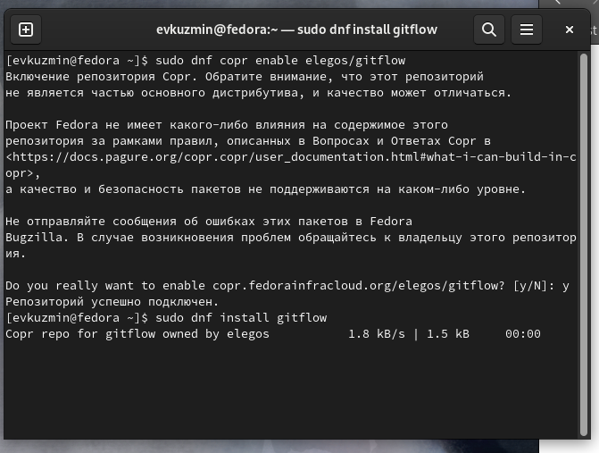{#fig:001 width=70%}

## Установка и настройка программного обеспечения

 Устанавливаю Node.js (рис. 2).

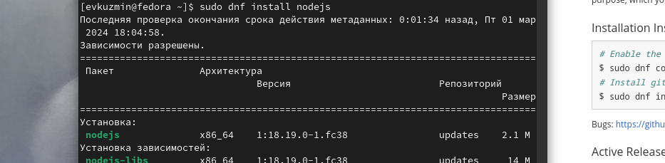{#fig:002 width=70%}

## Установка и настройка программного обеспечения

 Устанавливаю  pnpm (рис. 3)

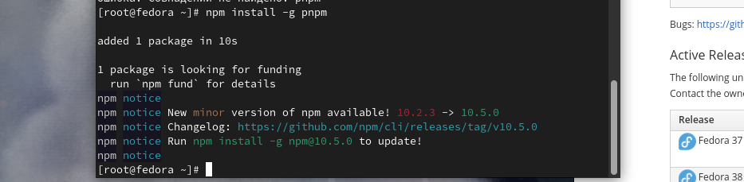{#fig:003 width=70%}

## Установка и настройка программного обеспечения

 Начинаю настройку Node.js (рис. 4)
 
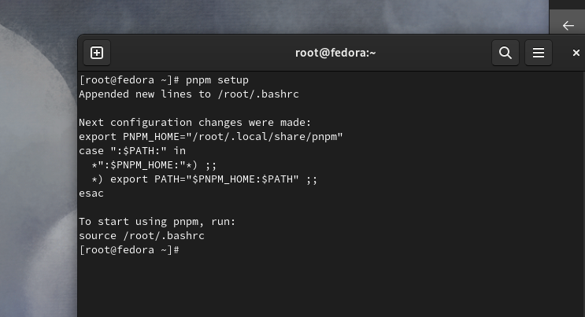{#fig:004 width=70%}

## Установка и настройка программного обеспечения

 Завершаю настройку Node.js и устанавливаю программу для помощи в форматировании коммитов (рис. 5)
 
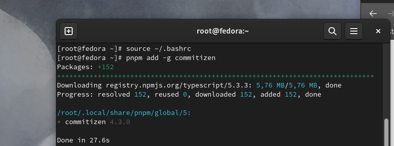{#fig:005 width=70%}

## Общепринятые коммиты

 Создаю репозиторий (рис. 6).

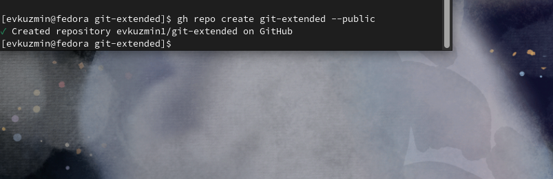{#fig:006 width=70%}

## Общепринятые коммиты

 Конфигурирую пакеты Node.js - формат коммитов (рис. 7)

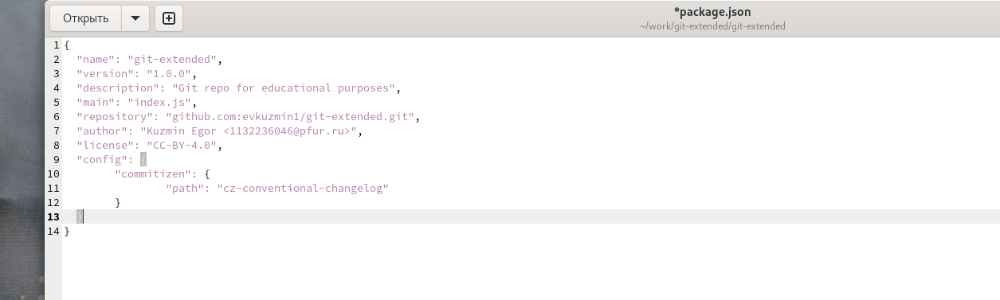{#fig:007 width=70%}

## Общепринятые коммиты

 Инициализирую git-flow (рис. 8)

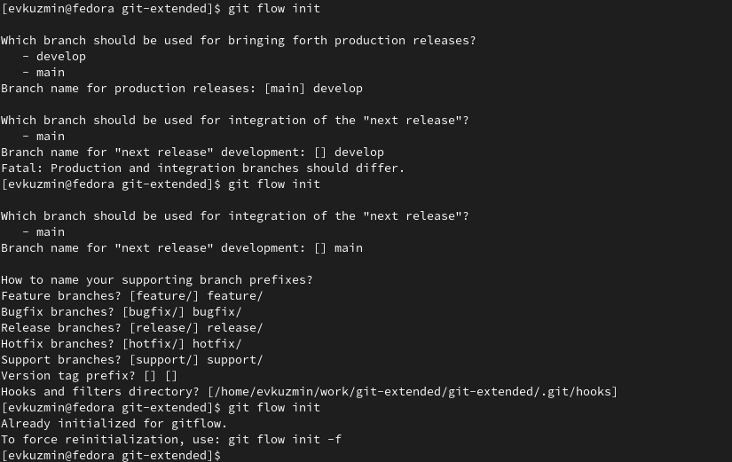{#fig:008 width=70%}

  - Создаю релиз с версией 1.0.0
  - Создаю журнал изменений
  - Добавляю журнал изменений в индекс
  - Заливаю релизную ветку в основную (рис. 9)
 
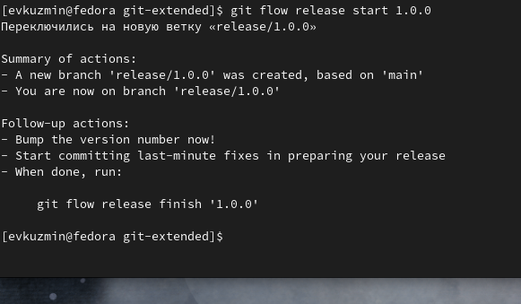{#fig:009 width=70%}

## Работа с репозиторием git

 Создаю ветку для новой функциональности. Далее нам потребуется объединить эти ветки (рис. 10)
 
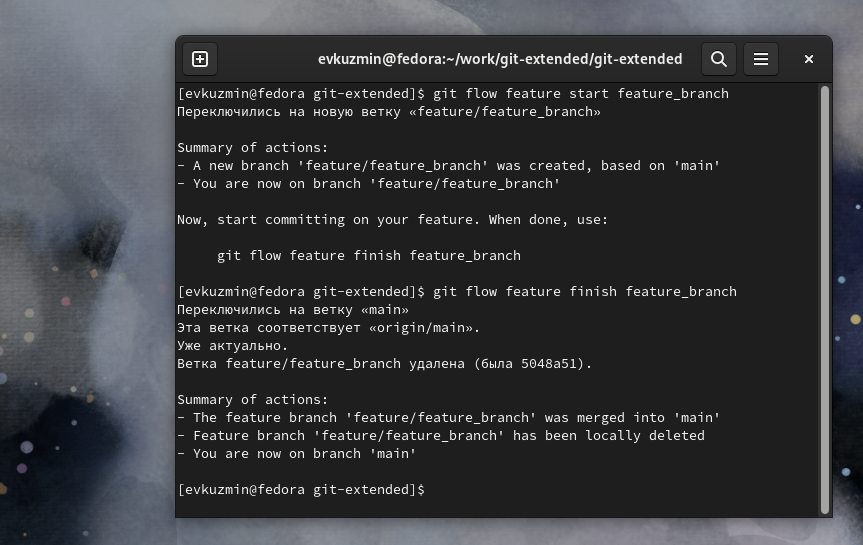{#fig:010 width=70%}

## Работа с репозиторием git

 Создаю релиз с версией 1.2.3 (рис. 11)
 
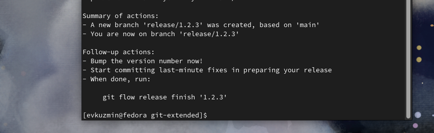{#fig:011 width=70%} 

## Работа с репозиторием git

 Затем перемещаю релизную ветку в основную ветку (рис. 12)
 
{#fig:012 width=70%} 

## Работа с репозиторием git

 Отправляю все данные на github и сразу же создаю релиз на github с комментарием из журнала изменений (рис. 13)
 
{#fig:013 width=70%}

## Выводы

  Я приобрел практический опыт работы с репозиториями git на продвинутом уровне, научился доустанавливать нужные пакеты и настраивать их для определенных задач.

## Список литературы{.unnumbered}

[Архитектура компьютеров и ОС/Электронный ресурс](https://esystem.rudn.ru/mod/page/view.php?id=1098794)

