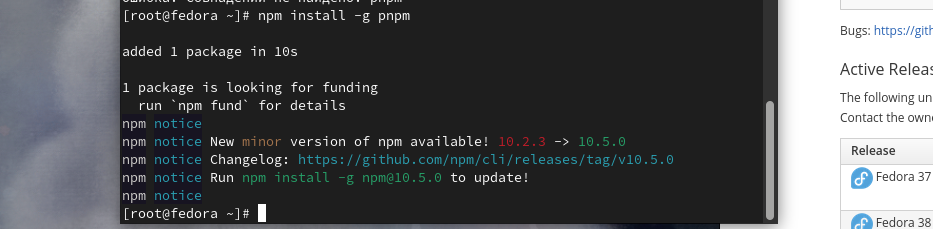
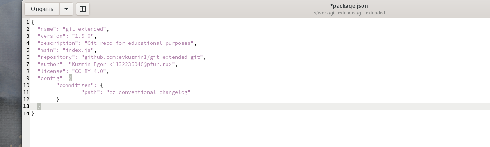

---
## Front matter
title: "Отчет по лабораторной работе №4"
subtitle: "Операционные системы"
author: "Кузьмин Егор Витальевич"

## Generic otions
lang: ru-RU
toc-title: "Содержание"

## Bibliography
bibliography: bib/cite.bib
csl: pandoc/csl/gost-r-7-0-5-2008-numeric.csl

## Pdf output format
toc: true # Table of contents
toc-depth: 2
lof: true # List of figures
lot: true # List of tables
fontsize: 12pt
linestretch: 1.5
papersize: a4
documentclass: scrreprt
## I18n polyglossia
polyglossia-lang:
  name: russian
  options:
	- spelling=modern
	- babelshorthands=true
polyglossia-otherlangs:
  name: english
## I18n babel
babel-lang: russian
babel-otherlangs: english
## Fonts
mainfont: PT Serif
romanfont: PT Serif
sansfont: PT Sans
monofont: PT Mono
mainfontoptions: Ligatures=TeX
romanfontoptions: Ligatures=TeX
sansfontoptions: Ligatures=TeX,Scale=MatchLowercase
monofontoptions: Scale=MatchLowercase,Scale=0.9
## Biblatex
biblatex: true
biblio-style: "gost-numeric"
biblatexoptions:
  - parentracker=true
  - backend=biber
  - hyperref=auto
  - language=auto
  - autolang=other*
  - citestyle=gost-numeric
## Pandoc-crossref LaTeX customization
figureTitle: "Рис."
tableTitle: "Таблица"
listingTitle: "Листинг"
lofTitle: "Список иллюстраций"
lotTitle: "Список таблиц"
lolTitle: "Листинги"
## Misc options
indent: true
header-includes:
  - \usepackage{indentfirst}
  - \usepackage{float} # keep figures where there are in the text
  - \floatplacement{figure}{H} # keep figures where there are in the text
---

# Цель работы

 Цель данной лабораторной работы - получение навыков правильной работы с репозиториями git.

# Задание

 0. Ознакомиться с заданием и дополнительным программным обеспечением.
 1. Выполнить работу для тестового репозитория.
 2. Преобразовать рабочий репозиторий в репозиторий с git-flow и conventional commits.

# Теоретическое введение

    Gitflow Workflow опубликована и популяризована Винсентом Дриссеном.
    Gitflow Workflow предполагает выстраивание строгой модели ветвления с учётом выпуска проекта.
    Данная модель отлично подходит для организации рабочего процесса на основе релизов.
    Работа по модели Gitflow включает создание отдельной ветки для исправлений ошибок в рабочей среде.
    Последовательность действий при работе по модели Gitflow:
   	1. Из ветки master создаётся ветка develop.
    	2. Из ветки develop создаётся ветка release.
    	3. Из ветки develop создаются ветки feature.
    	4. Когда работа над веткой feature завершена, она сливается с веткой develop.
   	5. Когда работа над веткой релиза release завершена, она сливается в ветки develop и master.
   	6. Если в master обнаружена проблема, из master создаётся ветка hotfix.
   	7. Когда работа над веткой исправления hotfix завершена, она сливается в ветки develop и master.

# Выполнение лабораторной работы

## Установка и настройка программного обеспечения

 Устанавливаю git-flow (рис. 1).

{#fig:001 width=70%}

 Видим сообщение об успешности загрузки (рис. 2)

{#fig:002 width=70%}

 Устанавливаю Node.js (рис. 3).

{#fig:003 width=70%}

 Видим сообщение об успешности загрузки (рис. 4)
 
{#fig:004 width=70%}
 
 Устанавливаю  pnpm (рис. 5)

{#fig:005 width=70%}

 Начинаю настройку Node.js (рис. 6)
 
{#fig:006 width=70%}

 Завершаю настройку Node.js и устанавливаю программу для помощи в форматировании коммитов (рис. 7)
 
{#fig:007 width=70%}

 Добавляем программу для помощи в создании логов (рис. 8)
 
{#fig:008 width=70%}

 Устанавливаем пакет "стандарт" (рис. 9)
 
{#fig:009 width=70%}

## Общепринятые коммиты

 Создаю репозиторий (рис. 10).

{#fig:010 width=70%}

 Делаю первый коммит и выкладываю его на гитхаб.

 Конфигурирую пакеты Node.js - формат коммитов (рис. 11)

{#fig:011 width=70%}

 Добавляю новые файлы, выполняю коммит (рис. 12)
 
{#fig:012 width=70%}

 Инициализирую git-flow (рис. 13)

{#fig:013 width=70%}

 Проверяю ветку и загружаю весь репозиторий в хранилище. Далее устанавливаю внешнюю ветку как вышестоящую (рис. 14)

{#fig:014 width=70%}

 Создаю релиз с версией 1.0.0, создаю журнал изменений, добавляю журнал изменений в индекс. Заливаю релизную ветку в основную (рис. 15)
 
{#fig:015 width=70%}
 
 Отправляю все данные в git. Создаю на нём релиз (рис. 16)
 
{#fig:016 width=70%}

## Работа с репозиторием git
  
 Создаю ветку для новой функциональности. Далее нам потребуется объединить эти ветки (рис. 17)
 
{#fig:017 width=70%}

 Создаю релиз с версией 1.2.3 (рис. 18)
 
{#fig:018 width=70%} 
 
 Создаю журнал изменений, добавляю журнал изменений в индекс (рис. 19)
  
{#fig:019 width=70%}
  
 Затем перемещаю релизную ветку в основную ветку (рис. 20)
 
{#fig:020 width=70%} 
  
 Отправляю все данные на github и сразу же создаю релиз на github с комментарием из журнала изменений (рис. 21)
 
{#fig:021 width=70%}

# Выводы

 Я приобрел практический опыт работы репозиториями git на продвинутом уровне, научился доустанавливать нужные пакеты и настраивать их для определенных задач.

# Список литературы{.unnumbered}

 [Архитектура компьютеров и ОС/Электронный ресурс](https://esystem.rudn.ru/mod/page/view.php?id=1098794)
  
  
