---
## Front matter
lang: ru-RU
title: Лабораторная работа №8
subtitle: Операционные системы
author:
  - Кузьмин Егор Витальевич, НКАбд-03-23
institute:
  - Российский университет дружбы народов, Москва, Россия
date: 26 марта 2024

## i18n babel
babel-lang: russian
babel-otherlangs: english

## Formatting pdf
toc: false
toc-title: Содержание
slide_level: 2
aspectratio: 169
section-titles: true
theme: metropolis
header-includes:
 - \metroset{progressbar=frametitle,sectionpage=progressbar,numbering=fraction}
 - '\makeatletter'
 - '\beamer@ignorenonframefalse'
 - '\makeatother'
 
## font
mainfont: PT Serif
romanfont: PT Serif
sansfont: PT Sans
monofont: PT Mono
mainfontoptions: Ligatures=TeX
romanfontoptions: Ligatures=TeX
sansfontoptions: Ligatures=TeX,Scale=MatchLowercase
monofontoptions: Scale=MatchLowercase,Scale=0.9
---

## Цель работы

 Целью данной лабораторной работы является ознакомление с инструментами поиска файлов и фильтрации текстовых данных, а также приобретение практических навыков по управлению процессами, использованию диска и по обслуживанию файловых систем.

## Выполнение лабораторной работы

 Записываю в файл file.txt названия файлов из каталога /etc с помощью перенаправления ">".

{#fig:001 width=70%}

## Выполнение лабораторной работы

 Проверяю, что в файл записались нужные значения, делая это с помощью утилиты head
 
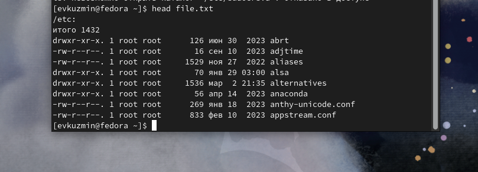{#fig:002 width=70%}

## Выполнение лабораторной работы

 Добавляю в созданный файл имена файлов из домашнего каталога, вывожу на экран имена всех файлов, имеющих расширение ".conf" с помощью утилиты grep

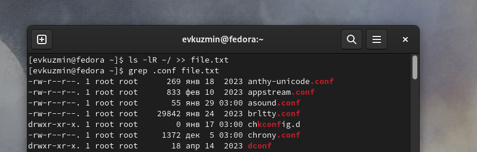{#fig:003 width=70%}

## Выполнение лабораторной работы

 Добавляю вывод прошлой команды в новый файл conf.txt с помощью перенаправления

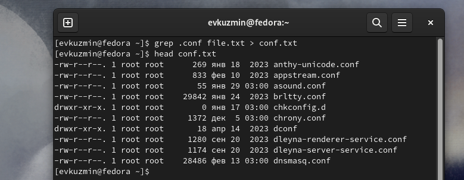{#fig:004 width=70%}

## Выполнение лабораторной работы

 Нахожу элементы с первым симоволом "с" двумя способами
 
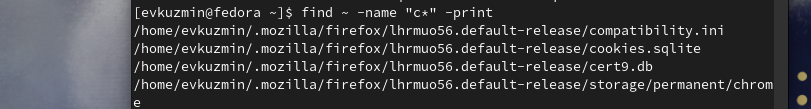{#fig:005 width=70%}

## Выполнение лабораторной работы

 С помощью метода find  ищу все файлы, начинающиеся с буквы "h" 

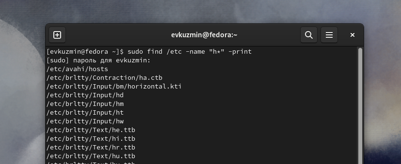{#fig:007 width=70%}

## Выполнение лабораторной работы

  - Запускаю в фоновом режиме, с помощью "&" процесс, который ">" будет записывать в logfile файлы, имена которых начинаются с log. 
  - Проверяю, что файл создан
  - Удаляю его
  - Проверяю, что файл удален
 
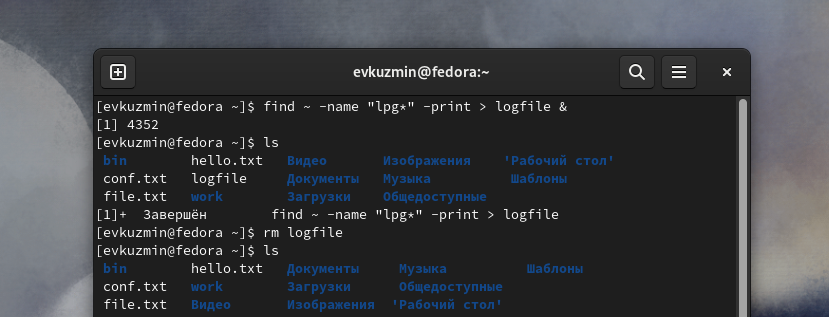{#fig:008 width=70%}

## Выполнение лабораторной работы

 - Запускаю в консоли в фоновом режиме редактор gedit
 - С помощью утилиты ps определяю идентификатор процесса
 - Также мы можем определить это значение с помощью pgrep, pidof

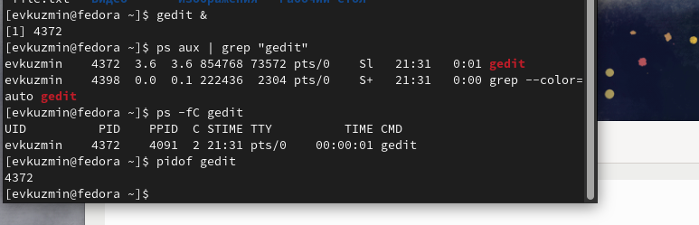{#fig:009 width=70%}

## Выполнение лабораторной работы

 Читаю справку команды kill

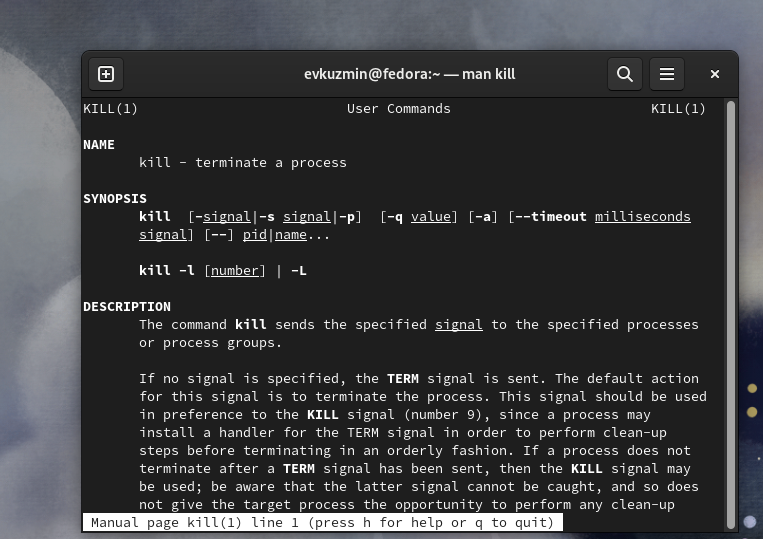{#fig:010 width=70%}

## Выполнение лабораторной работы

 Использую команду kill идентификатор процесса, чтобы его удалить
 - Процесс gedit закрылся
 - Далее читаю документацию про функции du и df 

{#fig:011 width=70%}

## Выполнение лабораторной работы

 Использую утилиту df с опцией -vi, утилиту du

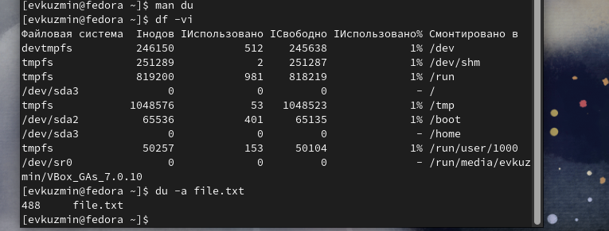{#fig:012 width=70%}

## Выполнение лабораторной работы

 Читаю документацию о команде find 

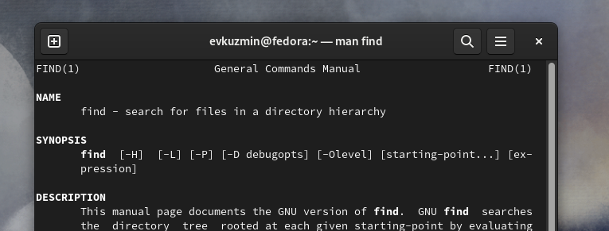{#fig:013 width=70%}

## Выполнение лабораторной работы

 Вывожу имена всех директорий, имеющихся в моем домашнем каталоге
 
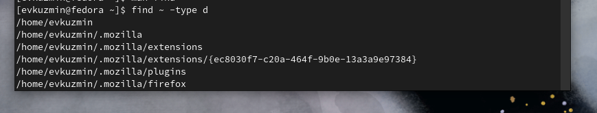{#fig:014 width=70%}

## Выводы

 В результате данной лабораторной работы я ознакомился с инструментами поиска файлов и фильтрации текстовых данных, а также приобрел практические навыки по управлению процессами, по проверке диске и обслуживанию файловых систем

