---
## Front matter
title: "Отчет по выполнению лабораторной работы №8"
subtitle: "Операционные системы"
author: "Кузьмин Егор Витальевич"

## Generic otions
lang: ru-RU
toc-title: "Содержание"

## Bibliography
bibliography: bib/cite.bib
csl: pandoc/csl/gost-r-7-0-5-2008-numeric.csl

## Pdf output format
toc: true # Table of contents
toc-depth: 2
lof: true # List of figures
lot: true # List of tables
fontsize: 12pt
linestretch: 1.5
papersize: a4
documentclass: scrreprt
## I18n polyglossia
polyglossia-lang:
  name: russian
  options:
	- spelling=modern
	- babelshorthands=true
polyglossia-otherlangs:
  name: english
## I18n babel
babel-lang: russian
babel-otherlangs: english
## Fonts
mainfont: PT Serif
romanfont: PT Serif
sansfont: PT Sans
monofont: PT Mono
mainfontoptions: Ligatures=TeX
romanfontoptions: Ligatures=TeX
sansfontoptions: Ligatures=TeX,Scale=MatchLowercase
monofontoptions: Scale=MatchLowercase,Scale=0.9
## Biblatex
biblatex: true
biblio-style: "gost-numeric"
biblatexoptions:
  - parentracker=true
  - backend=biber
  - hyperref=auto
  - language=auto
  - autolang=other*
  - citestyle=gost-numeric
## Pandoc-crossref LaTeX customization
figureTitle: "Рис."
tableTitle: "Таблица"
listingTitle: "Листинг"
lofTitle: "Список иллюстраций"
lotTitle: "Список таблиц"
lolTitle: "Листинги"
## Misc options
indent: true
header-includes:
  - \usepackage{indentfirst}
  - \usepackage{float} # keep figures where there are in the text
  - \floatplacement{figure}{H} # keep figures where there are in the text
---

# Цель работы

 Целью данной лабораторной работы является ознакомление с инструментами поиска файлов и фильтрации текстовых данных, а также приобретение практических навыков по управлению процессами, использованию диска и по обслуживанию файловых систем.

# Задание

 0. Ознакомиться с необходимой технической информацией
 
 1. Осуществите вход в систему, используя соответствующее имя пользователя.
 
 2. Запишите в файл file.txt названия файлов, содержащихся в каталоге /etc. Допи-
шите в этот же файл названия файлов, содержащихся в вашем домашнем каталоге.

 3. Выведите имена всех файлов из file.txt, имеющих расширение .conf, после чего
запишите их в новый текстовой файл conf.txt.

 4. Определите, какие файлы в вашем домашнем каталоге имеют имена, начинавшиеся
с символа c? Предложите несколько вариантов, как это сделать.

 5. Выведите на экран (по странично) имена файлов из каталога /etc, начинающиеся
с символа h.

 6. Запустите в фоновом режиме процесс, который будет записывать в файл ~/logfile
файлы, имена которых начинаются с log.

 7. Удалите файл ~/logfile.
 
 8. Запустите из консоли в фоновом режиме редактор gedit.
 
 9. Определите идентификатор процесса gedit, используя команду ps, конвейер и фильтр
grep. Как ещё можно определить идентификатор процесса?

 10. Прочтите справку (man) команды kill, после чего используйте её для завершения
процесса gedit.

 11. Выполните команды df и du, предварительно получив более подробную информацию
об этих командах, с помощью команды man.

 12. Воспользовавшись справкой команды find, выведите имена всех директорий, имею-
щихся в вашем домашнем каталоге.

# Теоретическое введение

 В интерфейсе командной строки есть очень полезная возможность перенаправления (переадресации) ввода и вывода (англ. термин I/O Redirection). Как мы уже заметили, многие программы выводят данные на экран. А ввод данных в терминале осуществляется с клавиатуры. С помощью специальных обозначений можно перенаправить вывод многих команд в файлы или иные устройства вывода (например, распечатать на принтере). Тоже самое и со вводом информации, вместо ввода данных с клавиатуры, для многих программ можно задать считывание символов их файла. Кроме того, можно даже вывод одной программы передать на ввод другой программе.

 К каждой программе, запускаемой в командной строке, по умолчанию подключено три потока данных:

 STDIN (0) — стандартный поток ввода (данные, загружаемые в программу). STDOUT (1) — стандартный поток вывода (данные, которые выводит программа). По умолчанию — терминал. STDERR (2) — стандартный поток вывода диагностических и отладочных сообщений (например, сообщениях об ошибках). По умолчанию — терминал.

 Pipe (конвеер) – это однонаправленный канал межпроцессного взаимодействия. Термин был придуман Дугласом Макилроем для командной оболочки Unix и назван по аналогии с трубопроводом. Конвейеры чаще всего используются в shell-скриптах для связи нескольких команд путем перенаправления вывода одной команды (stdout) на вход (stdin) последующей, используя символ конвеера ‘|’.

# Выполнение лабораторной работы

 Записываю в файл file.txt названия файлов из каталога /etc с помощью перенаправления ">" (записав в него то, что могло быть выведено ls -lR /etc). В файл я включил также все файлы из подкаталогов (рис. 1).

{#fig:001 width=70%}

 Проверяю, что в файл записались нужные значения, делая это с помощью утилиты head: она выводит первые 10 строк файла на экран (рис. 2).

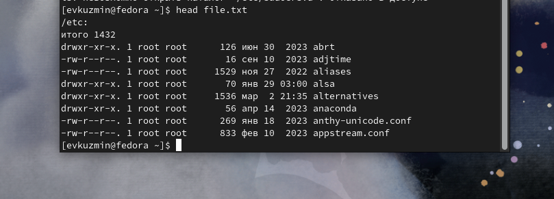{#fig:002 width=70%}

 Добавляю в созданный файл имена файлов из домашнего каталога, используя перенаправление ">>" в режиме добавления, вывожу на экран имена всех файлов, имеющих расширение ".conf" с помощью утилиты grep (рис. 3).

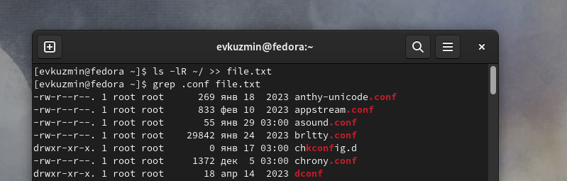{#fig:003 width=70%}

 Добавляю вывод прошлой команды в новый файл conf.txt с помощью перенаправления ">" (файл создается при выполнении этой команды). Делаю проверку (рис. 4).

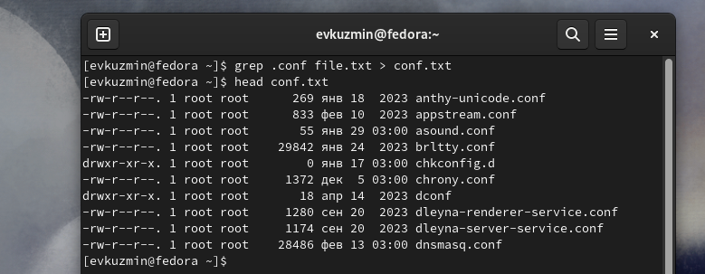{#fig:004 width=70%}

 Первый способ состоит в том, чтобы определить, какие файлы в домашнем каталоге начинаются с символа "c", делая это с помощью утилиты find. Прописываю ей в аргументах домашнюю директорию, выбираю опцию -name, и пишу маску, по которой будем искать имя, где * - любое кол-во любых символов, Аналогично добавляю опцию -print, чтобы мне вывелся результат (рис. 5)

{#fig:005 width=70%}

 Второй способ - это  использовать утилиту ls -lR и использовать grep, чтобы найти элементы с первым символом c. Однако этот способ не работает для поиска файлов из подкаталогов каталога (рис. 6).

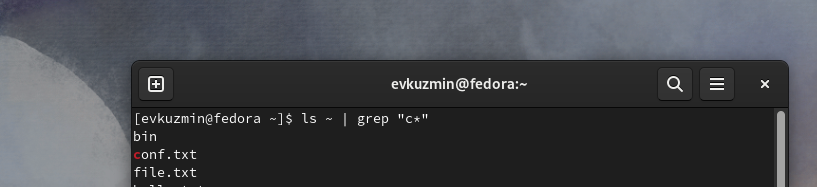{#fig:006 width=70%}

 С помощью метода find  ищу все файлы, начинающиеся с буквы "h" (рис. 7).

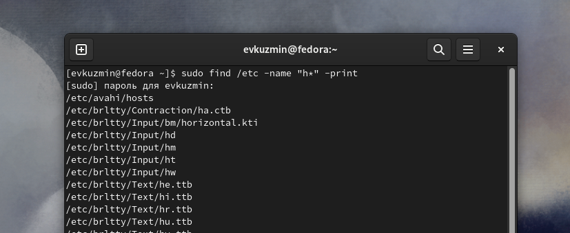{#fig:007 width=70%}

 Запускаю в фоновом режиме, с помощью "&" процесс, который ">" будет записывать в logfile файлы, имена которых начинаются с log. Проверяю, что файл создан, удаляю его, проверяю, что файл удален (рис. 8).
 
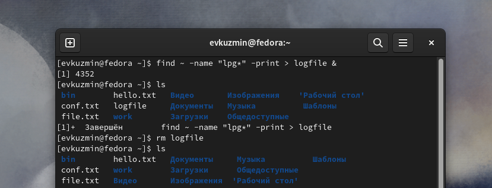{#fig:008 width=70%}

 Запускаю в консоли в фоновом режиме редактор gedit. С помощью утилиты ps определяю идентификатор процесса. Также мы можем определить это значение с помощью pgrep, pidof. (рис. 9).

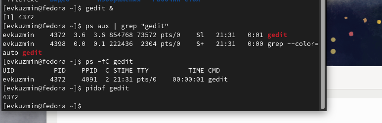{#fig:009 width=70%}

 Читаю справку команды kill (рис. 10).

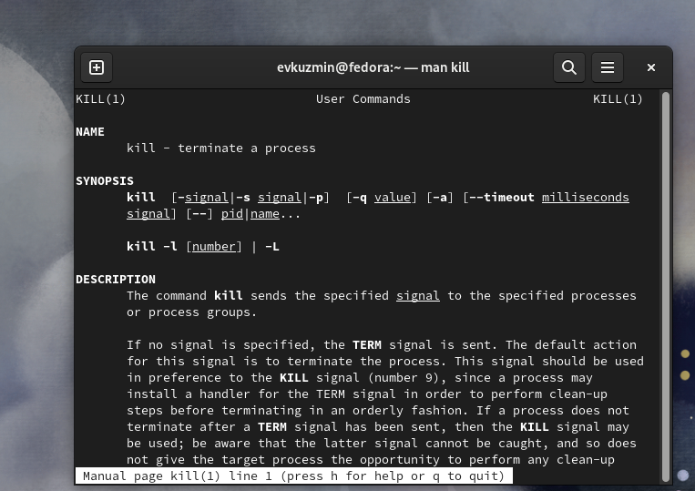{#fig:010 width=70%}

 Использую команду kill и идентификатор процесса, чтобы его удалить. Процесс gedit закрылся. Далее читаю документацию про функции du и df (рис. 11).

{#fig:011 width=70%}

 Использую утилиту df с опцией -vi, которая позволяет выяснить, сколько свободного места есть у нашей системы.  Использую утилиту du. Она нужна чтобы просмотреть, сколько места занимают файлы в определенной директории (рис. 12).

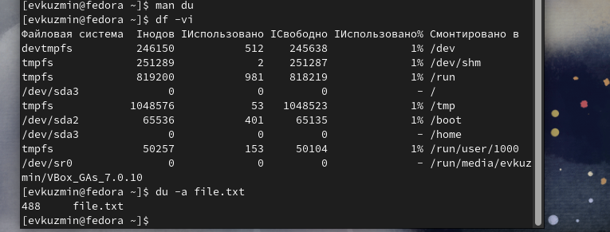{#fig:012 width=70%}

 Читаю документацию о команде find (рис. 13).

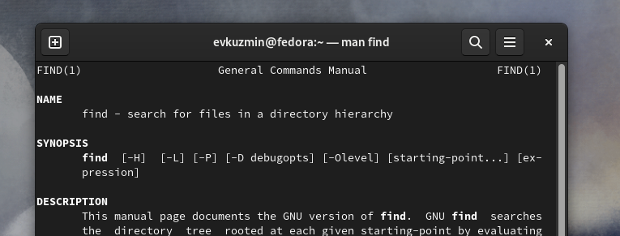{#fig:013 width=70%}

 Вывожу имена всех директорий, имеющихся в моем домашнем каталоге, используя аргумент d у утилиты find, а также опцию -type, указывающую тип файлов, который мне нужен (рис. 14)

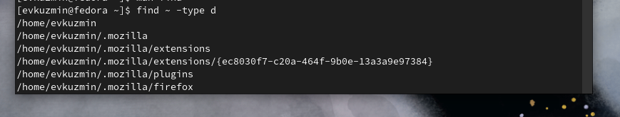{#fig:014 width=70%}

# Выводы

 В результате данной лабораторной работы я ознакомился с инструментами поиска файлов и фильтрации текстовых данных, а также приобрел практические навыки по управлению процессами, по проверке диске и обслуживанию файловых систем

# Ответы на контрольные вопросы

1. В системе по умолчанию открыто три специальных потока: – stdin — стандартный поток ввода (по умолчанию: клавиатура), файловый дескриптор 0; – stdout — стандартный поток вывода (по умолчанию: консоль), файловый дескриптор 1; – stderr — стандартный поток вывод сообщений об ошибках (по умолчанию: консоль), файловый дескриптор 2.

2.  Этот знак > - перенаправление ввода/вывода, а » - перенаправление в режиме добавления.

3. Конвейер (pipe) служит для объединения простых команд или утилит в цепочки, в которых результат работы предыдущей команды передаётся последующей.

4. Главное отличие между программой и процессом заключается в том, что программа - это набор инструкций, который позволяет ЦПУ выполнять определенную задачу, в то время как процесс - это исполняемая программа.

5. PPID - (parent process ID) идентификатор родительского процесса. Процесс может порождать и другие процессы. UID, GID - реальные идентификаторы пользователя и его группы, запустившего данный процесс.

6.  Запущенные фоном программы называются задачами (jobs). Ими можно управлять с помощью команды jobs, которая выводит список запущенных в данный момент задач.

7. Команда htop похожа на команду top по выполняемой функции: они обе показывают информацию о процессах в реальном времени, выводят данные о потреблении системных ресурсов и позволяют искать, останавливать и управлять процессами.

У обеих команд есть свои преимущества. Например, в программе htop реализован очень удобный поиск по процессам, а также их фильтрация. В команде top это не так удобно — нужно знать кнопку для вывода функции поиска.

Зато в top можно разделять область окна и выводить информацию о процессах в соответствии с разными настройками. В целом top намного более гибкая в настройке отображения процессов.

8. Назовите и дайте характеристику команде поиска файлов. Приведите примеры использования этой команды.

Команда find - это одна из наиболее важных и часто используемых утилит системы Linux. Это команда для поиска файлов и каталогов на основе специальных условий. Ее можно использовать в различных обстоятельствах, например, для поиска файлов по разрешениям, владельцам, группам, типу, размеру и другим подобным критериям.

Утилита find предустановлена по умолчанию во всех Linux дистрибутивах, поэтому вам не нужно будет устанавливать никаких дополнительных пакетов. Это очень важная находка для тех, кто хочет использовать командную строку наиболее эффективно.

Команда find имеет такой синтаксис: find [папка] [параметры] критерий шаблон [действие] Пример: find /etc -name "p*" -print

9. find / -type f -exec grep -H 'текстДляПоиска' {} ;

10. С помощью команды df -h.

11. С помощью команды du -s.

12. С помощью команды kill номер задачи.

## Список литературы{.unnumbered}

[Архитектура компьютеров и ОС/Электронный ресурс](https://esystem.rudn.ru/mod/page/view.php?id=1098787)
