---
## Front matter
lang: ru-RU
title: Лабораторная работа №9
subtitle: Операционные системы
author:
  - Кузьмин Егор Витальевич
institute:
  - Российский университет дружбы народов, Москва, Россия

date: 04 апреля 2024

## i18n babel
babel-lang: russian
babel-otherlangs: english

## Formatting pdf
toc: false
toc-title: Содержание
slide_level: 2
aspectratio: 169
section-titles: true
theme: metropolis
header-includes:
 - \metroset{progressbar=frametitle,sectionpage=progressbar,numbering=fraction}
 - '\makeatletter'
 - '\beamer@ignorenonframefalse'
 - '\makeatother'

## font
mainfont: PT Serif
romanfont: PT Serif
sansfont: PT Sans
monofont: PT Mono
mainfontoptions: Ligatures=TeX
romanfontoptions: Ligatures=TeX
sansfontoptions: Ligatures=TeX,Scale=MatchLowercase
monofontoptions: Scale=MatchLowercase,Scale=0.9
---

## Цель работы

 Цель данной лабораторной работы - освоение основных возможностей командной оболочки Midnight Commander, приобретение навыков практической работы по просмотру каталогов и файлов

## Выполнение лабораторной работы

 С помощью команды man mc читаю документацию про командную оболочку.

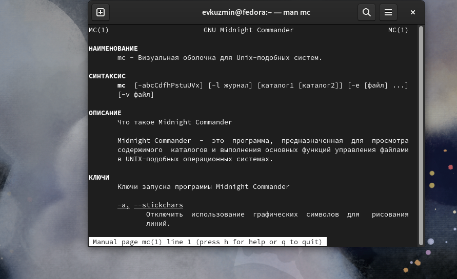

## Выполнение лабораторной работы

 Ввожу в терминале mc и получаю окно, в котором далее смогу работать.

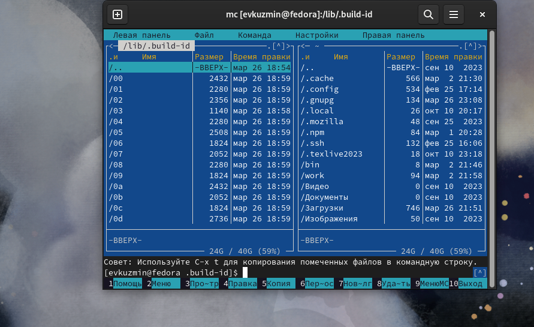

## Выполнение лабораторной работы

 С помощью F5 могу создать копию файла в выбранном каталоге

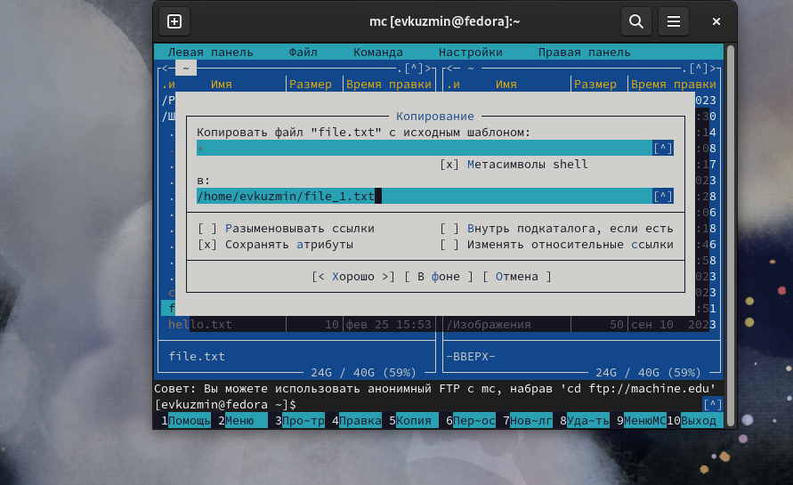

## Выполнение лабораторной работы

 С помощью управляющих клавиш так же можно получить информацию о правах доступа на файл и информацию о нем.

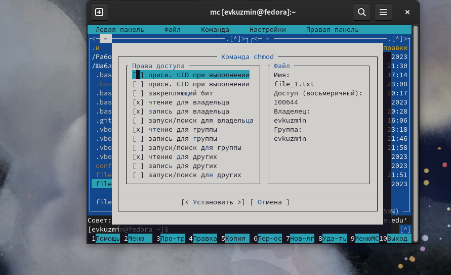.

## Выполнение лабораторной работы

 В меню правой панели вывожу информацию о файле.

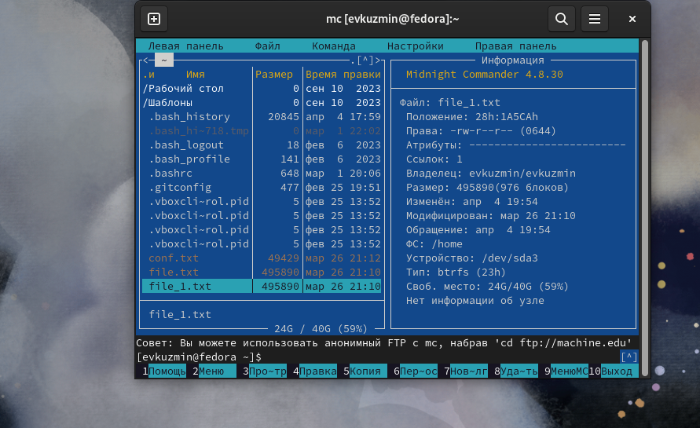

## Выполнение лабораторной работы

 Смотрю содержимое текстового файла.

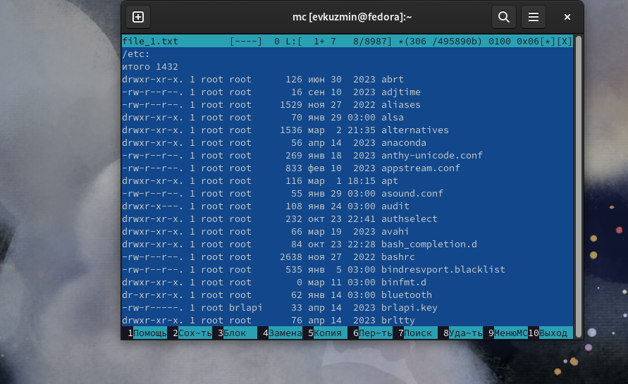

## Выполнение лабораторной работы

Открываю файл на изменение, закрываю с сохранением

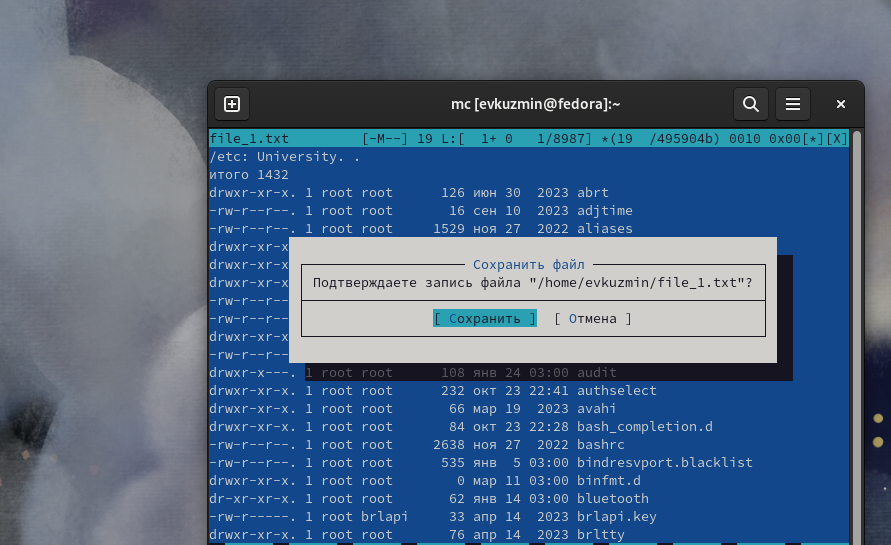

## Выполнение лабораторной работы

 Создаю новый каталог.

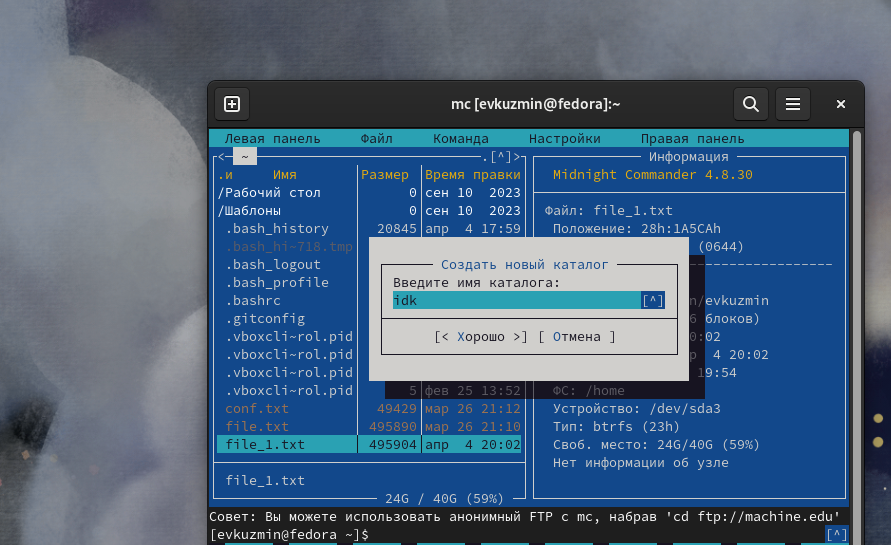

## Выполнение лабораторной работы

 Копирую файл в созданный каталог.

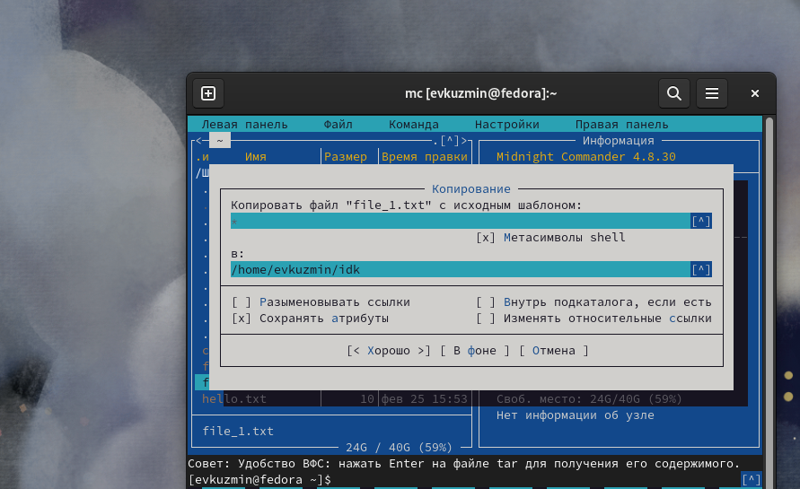

## Выполнение лабораторной работы

 С помощью средств ищу файлы с расширением ".с"

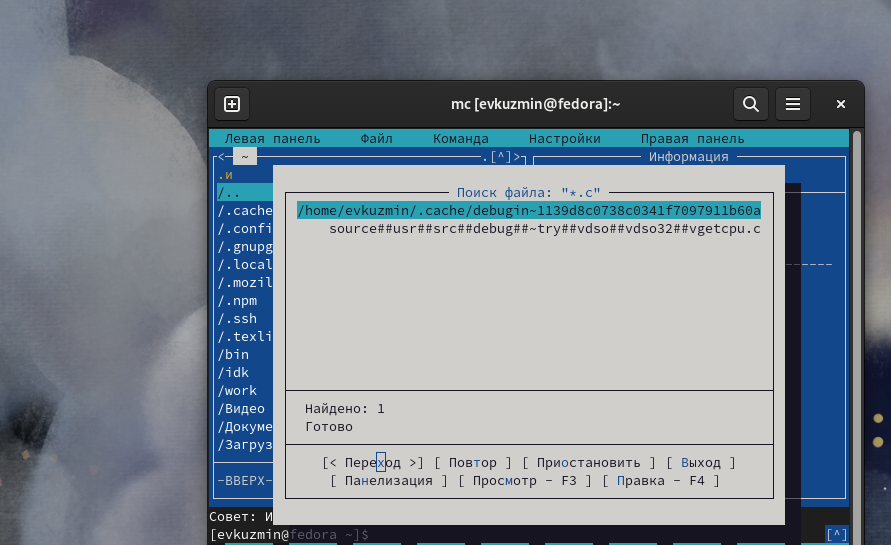

## Выполнение лабораторной работы

 Можно перемещаться между директориями, я перемещусь в домашнюю.

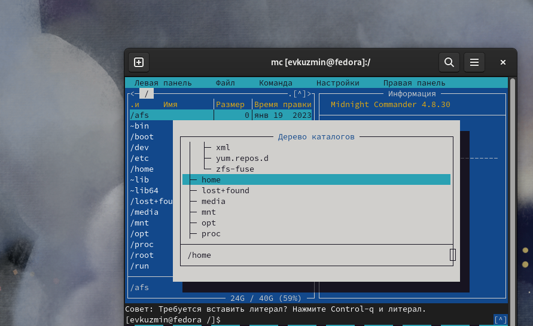

## Выполнение лабораторной работы

 Можно использовать историю команд и применить команду из истории, я применил копирование файла.

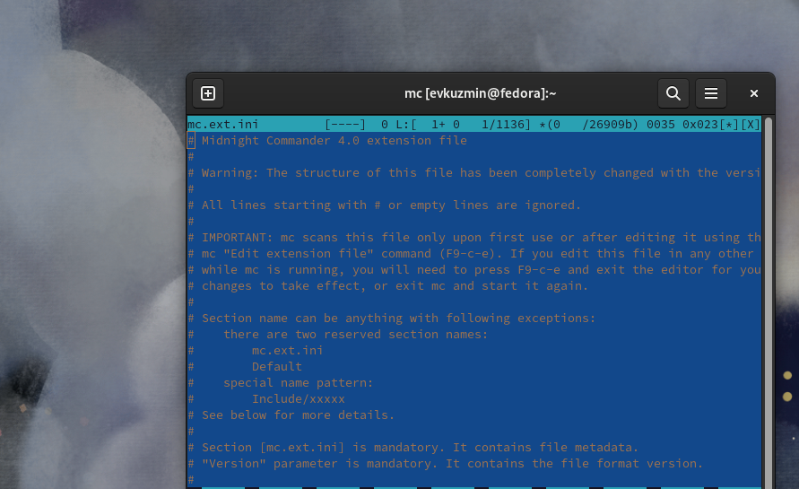

## Выполнение лабораторной работы

 Анализирую файл расширения и меню.

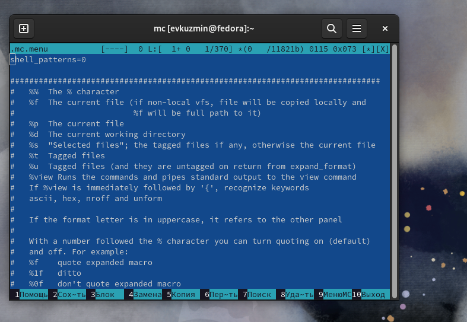

## Выполнение лабораторной работы

 Командой touch text.txt создаю файл.

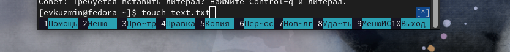

## Выполнение лабораторной работы

 Выделяю текст с помощью кликов мыши и блокирую с помощью F3.

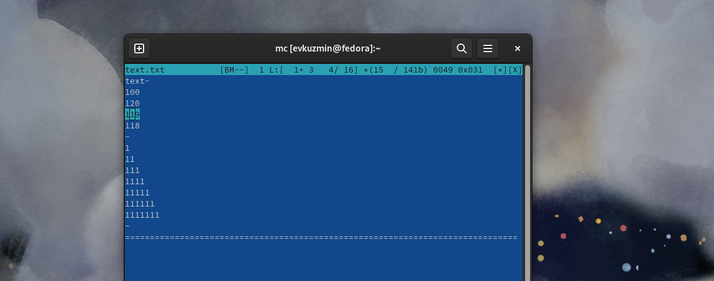

## Выполнение лабораторной работы

 Перемещаю выделенный текст с помощью клавиши F6.

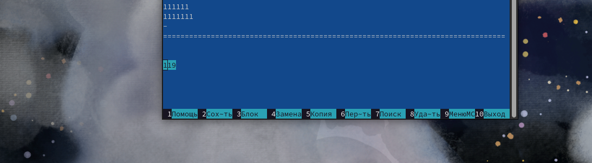

## Выполнение лабораторной работы

 Удаляю строку текста с помощью ctrl+y.

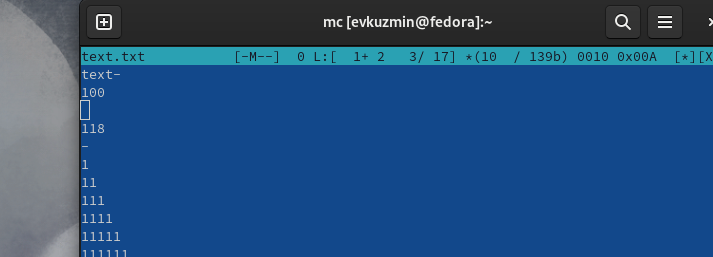

## Выполнение лабораторной работы

 С помощью ctrl+u отменяю последнее действие и возвращаю удаленную строку.

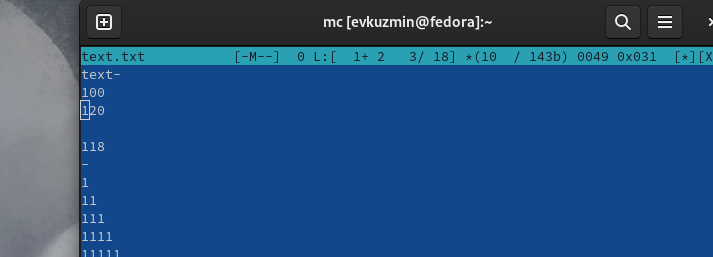

## Выполнение лабораторной работы

 С помощью клавиш pgup pgdn у меня получилось попасть в начало и в конец файла соответственно, я добавляю текст в начало и в конец файла.

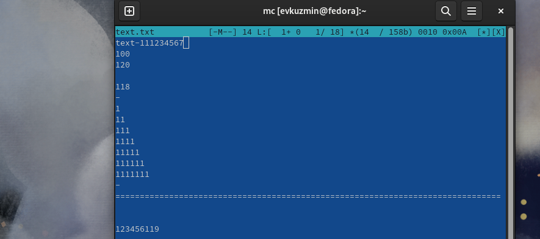

## Выполнение лабораторной работы

 Открываю файл формата .cpp, с кодом на С++, встроенный редактор mc вывел его содержимое с подсветкой.

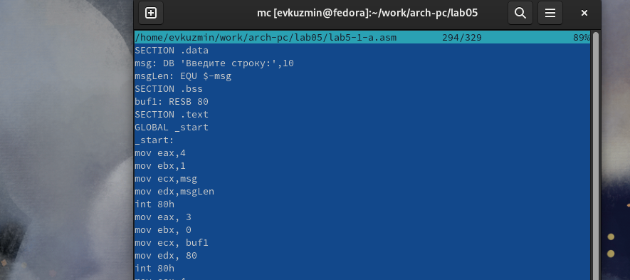

## Выполнение лабораторной работы

 Работаю с подсветкой

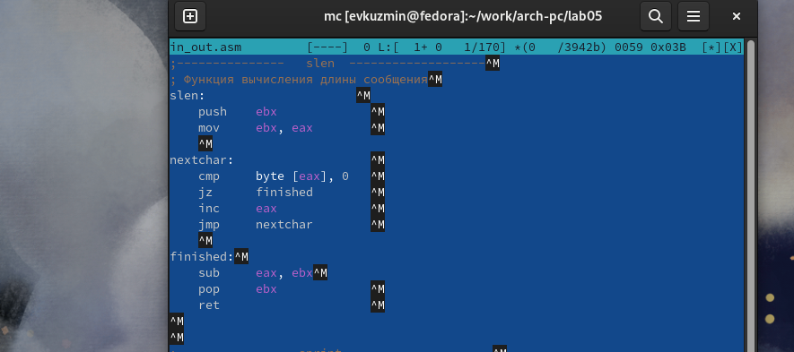

# Выводы

 При выполнениии данной лабораторной работы я освоил основные возможности командной оболочки Midnight Commander, приобрел навыки практической работы по просмотру каталогов и файлов

