---
## Front matter
title: "Отчет по лабораторной работе №9"
subtitle: "Операционные системы"
author: "Кузьмин Егор Витальевич"
## Generic otions
lang: ru-RU
toc-title: "Содержание"

## Bibliography
bibliography: bib/cite.bib
csl: pandoc/csl/gost-r-7-0-5-2008-numeric.csl

## Pdf output format
toc: true # Table of contents
toc-depth: 2
lof: true # List of figures
lot: true # List of tables
fontsize: 12pt
linestretch: 1.5
papersize: a4
documentclass: scrreprt
## I18n polyglossia
polyglossia-lang:
  name: russian
  options:
	- spelling=modern
	- babelshorthands=true
polyglossia-otherlangs:
  name: english
## I18n babel
babel-lang: russian
babel-otherlangs: english
## Fonts
mainfont: PT Serif
romanfont: PT Serif
sansfont: PT Sans
monofont: PT Mono
mainfontoptions: Ligatures=TeX
romanfontoptions: Ligatures=TeX
sansfontoptions: Ligatures=TeX,Scale=MatchLowercase
monofontoptions: Scale=MatchLowercase,Scale=0.9
## Biblatex
biblatex: true
biblio-style: "gost-numeric"
biblatexoptions:
  - parentracker=true
  - backend=biber
  - hyperref=auto
  - language=auto
  - autolang=other*
  - citestyle=gost-numeric
## Pandoc-crossref LaTeX customization
figureTitle: "Рис."
tableTitle: "Таблица"
listingTitle: "Листинг"
lofTitle: "Список иллюстраций"
lotTitle: "Список таблиц"
lolTitle: "Листинги"
## Misc options
indent: true
header-includes:
  - \usepackage{indentfirst}
  - \usepackage{float} # keep figures where there are in the text
  - \floatplacement{figure}{H} # keep figures where there are in the text
---

# Цель работы

 Целью данной лабораторной работы является освоение основных возможностей командной оболочки Midnight Commander, приобретение навыков практической работы по просмотру каталогов и файлов.

# Задание

 1. Изучите информацию о mc, вызвав в командной строке man mc.
 2. Запустите из командной строки mc, изучите его структуру и меню.
 3. Выполните несколько операций в mc, используя управляющие клавиши (операции с панелями; выделение/отмена выделения файлов, копирование/перемещение файлов, получение информации о размере и правах доступа на файлы и/или каталоги
и т.п.)
 4. Выполните основные команды меню левой (или правой) панели. Оцените степень
подробности вывода информации о файлах.
 5. Используя возможности подменю Файл , выполните:
  - просмотр содержимого текстового файла;
  - редактирование содержимого текстового файла (без сохранения результатов
  редактирования);
  - создание каталога;
  - копирование в файлов в созданный каталог.
 6. С помощью соответствующих средств подменю Команда осуществите:
  - поиск в файловой системе файла с заданными условиями (например, файла
  с расширением .c или .cpp, содержащего строку main);
  - выбор и повторение одной из предыдущих команд;
  - переход в домашний каталог;
  - анализ файла меню и файла расширений.
 7. Вызовите подменю Настройки . Освойте операции, определяющие структуру экрана mc
(Full screen, Double Width, Show Hidden Files и т.д.)

 Практическое задание 

 1. Создайте текстовой файл text.txt.
 2. Откройте этот файл с помощью встроенного в mc редактора.
 3. Вставьте в открытый файл небольшой фрагмент текста, скопированный из любого
другого файла или Интернета.
 4. Проделайте с текстом следующие манипуляции, используя горячие клавиши:
  - Удалите строку текста.
  - Выделите фрагмент текста и скопируйте его на новую строку
  - Выделите фрагмент текста и перенесите его на новую строку.
  - Сохраните файл.
  - Отмените последнее действие.
  - Перейдите в конец файла (нажав комбинацию клавиш) и напишите некоторый
  текст.
  - Перейдите в начало файла (нажав комбинацию клавиш) и напишите некоторый
  текст.
  4.8. Сохраните и закройте файл.
 5. Откройте файл с исходным текстом на некотором языке программирования (напри-
мер C или Java)
 6. Используя меню редактора, включите подсветку синтаксиса, если она не включена,
или выключите, если она включена

# Теоретическое введение

 Командная оболочка — интерфейс взаимодействия пользователя с операционной системой и программным обеспечением посредством команд. Midnight Commander (или mc) — псевдографическая командная оболочка для UNIX/Linux систем. Для запуска mc необходимо в командной строке набрать mc и нажать Enter .

 MC имеет много полезных как для пользователей, так и для администраторов, функций (копирование, удаление, переименование/перемещение, создание директорий).

 Главное окно программы Midnight Commander состоит из трех полей. Два поля, называемые "панелями", идентичны по структуре и обычно отображают перечни файлов и подкаталогов каких-то двух каталогов файловой структуры. Эти каталоги в общем случае различны, хотя, в частности, могут и совпасть. Каждая панель состоит из заголовка, списка файлов и информационной строки.

 Третье поле экрана, расположенное в нижней части экрана, содержит командную строку текущей оболочки. В этом же поле (самая нижняя строка экрана) содержится подсказка по использованию функциональных клавиш F1 - F10. Самая верхняя строка экрана содержит строку горизонтального меню. Эта строка может не отображаться на экране; в этом случае доступ к ней можно получить, щёлкнув мышью по верхней рамке или нажав клавишу F9.

# Выполнение лабораторной работы

 С помощью команды man mc читаю документацию про командную оболочку (рис. 1).

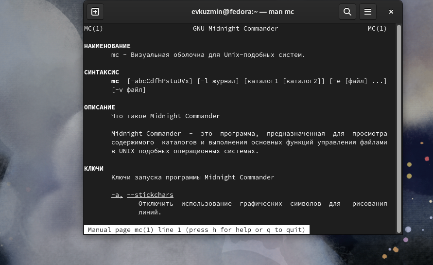{#fig:001 width=70%}

 Ввожу в терминале mc и получаю окно, в котором далее смогу работать (рис. 2).
 
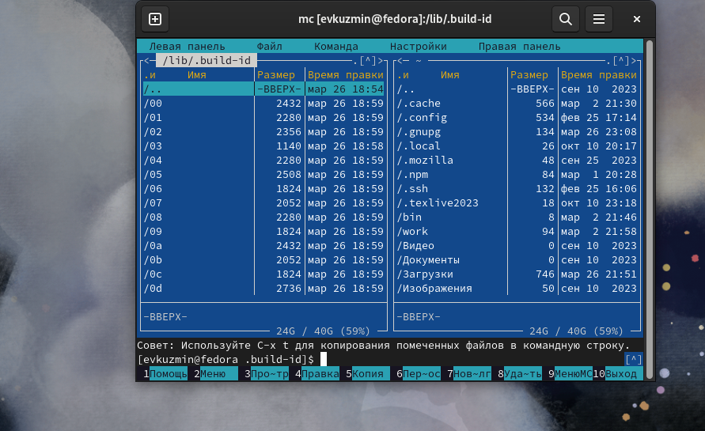{#fig:002 width=70%}

 С помощью F5 создаю копию выбранного файла  (рис. 3).

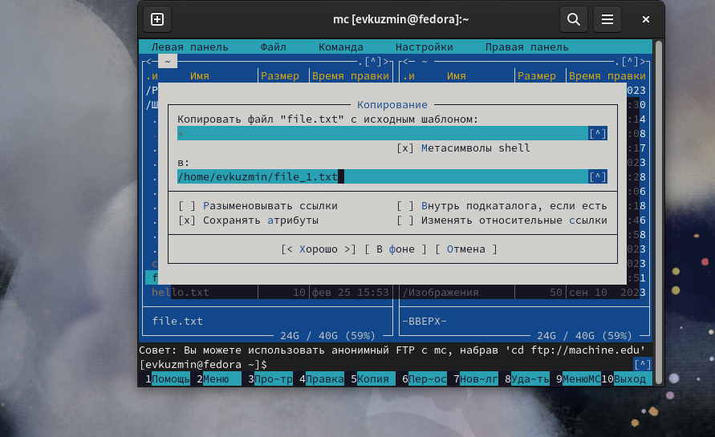{#fig:003 width=70%}

 С помощью функций в меню также можно получить информацию о правах доступа к файлу, и информацию иного рода (рис. 4).

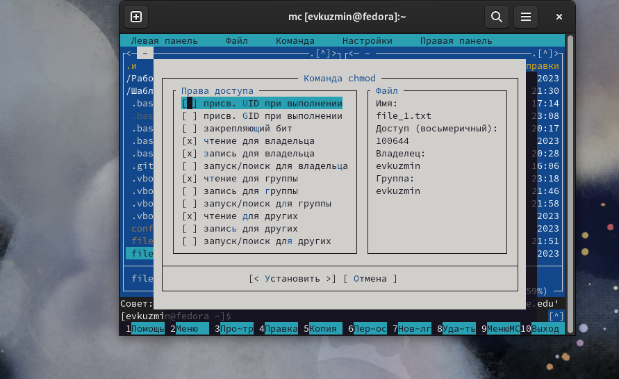{#fig:004 width=70%}

 В меню правой панели вывожу информацию о файле, получаю информации больше чем в командном выводе (рис. 5).

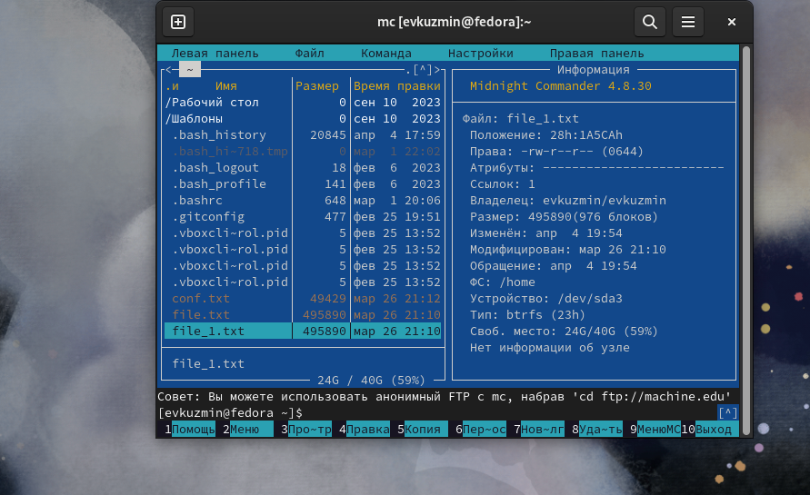{#fig:005 width=70%}

 Смотрю содержимое текстового файла  (рис. 6).

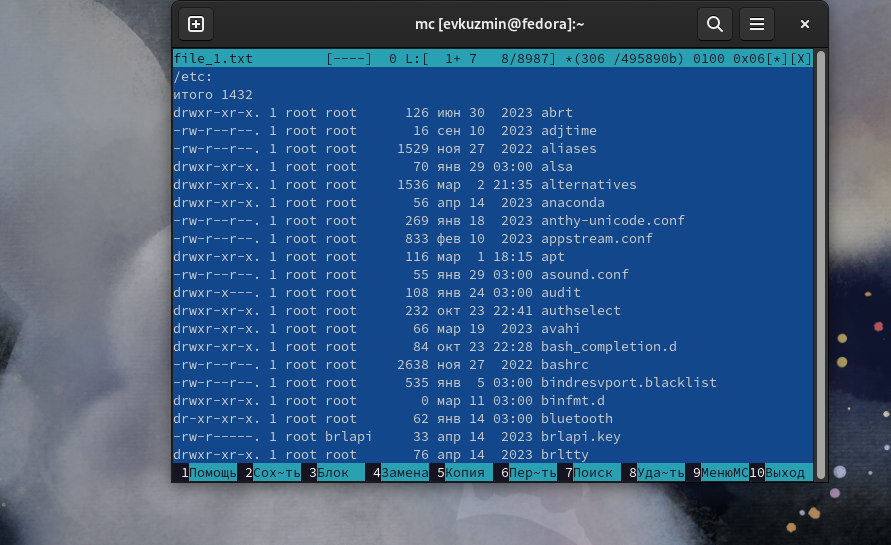{#fig:006 width=70%}

 Открываю файл на изменение, меняю пару строк, закрываю файл с сохранением (рис. 7).

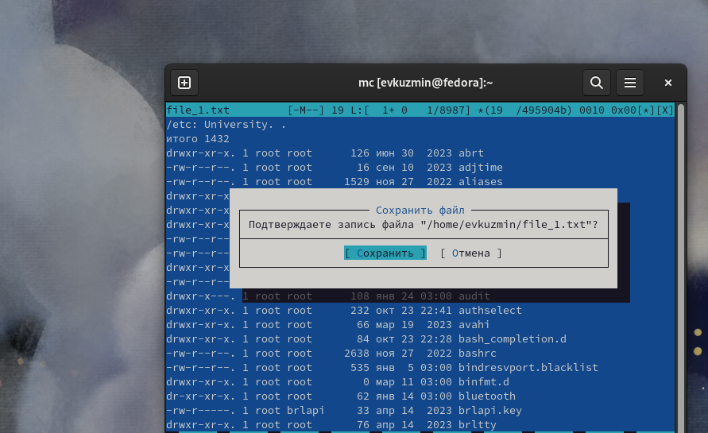{#fig:007 width=70%}

 Создал новый каталог (рис. 8).

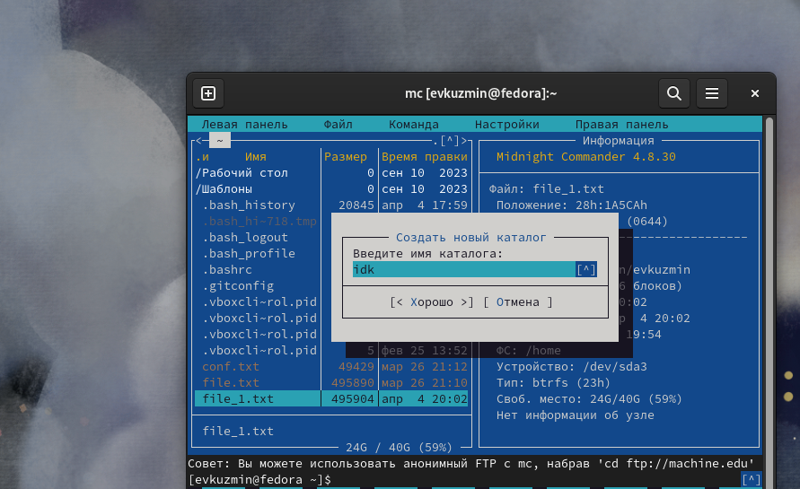{#fig:008 width=70%}

 Копирую файл в созданный каталог (рис. 9).

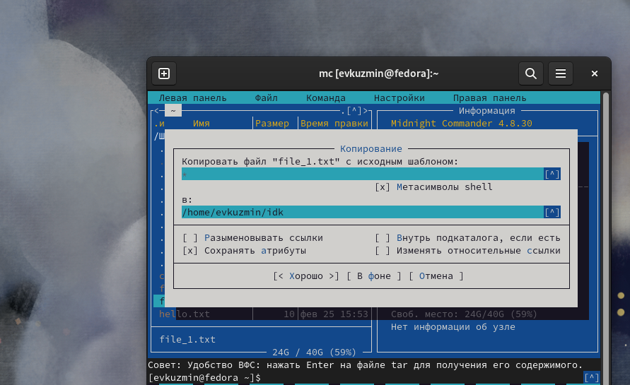{#fig:009 width=70%}

 С помощью mc можно найти файл с заданным условием, я искал форматы .с (рис. 10).

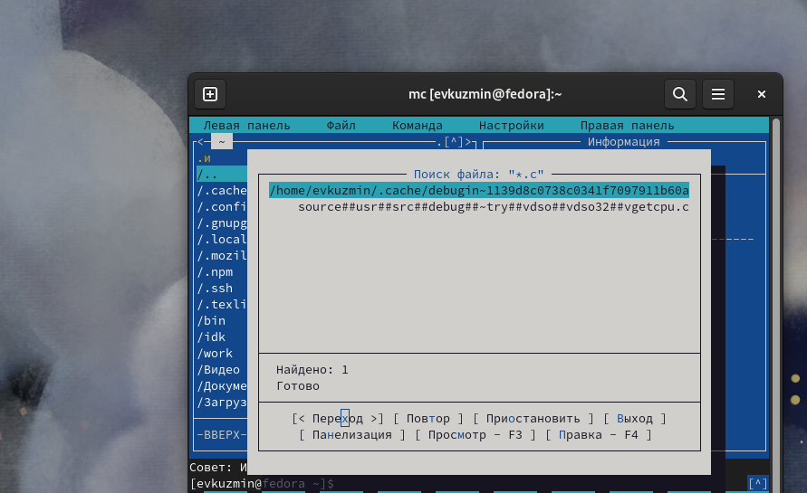{#fig:010 width=70%}

 Можно перемещаться между директориями, например в домашнюю (рис. 11).

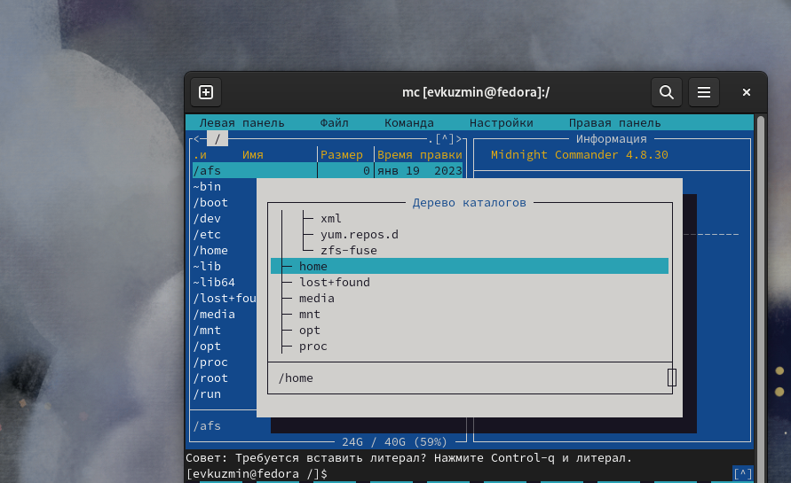{#fig:011 width=70%}

 Анализирую файл расширения (рис. 12).

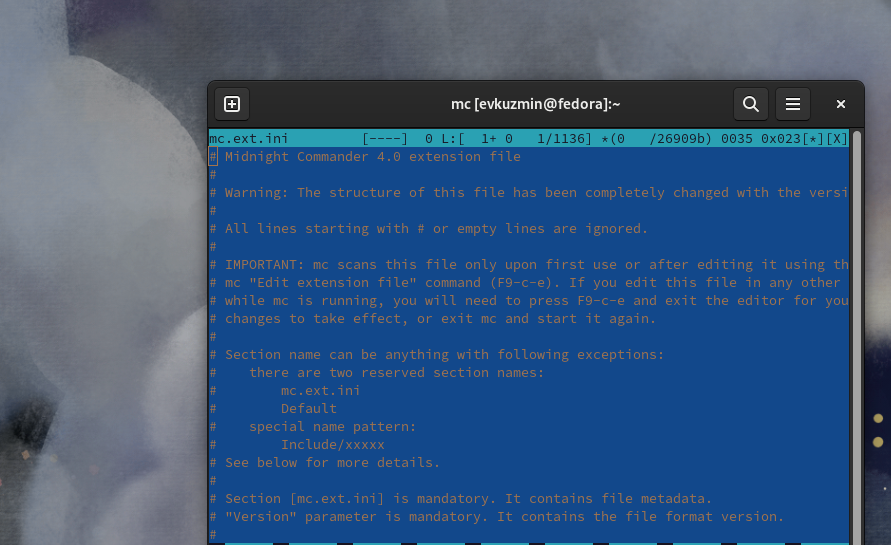{#fig:012 width=70%}

 Анализирую файл меню (рис. 13).

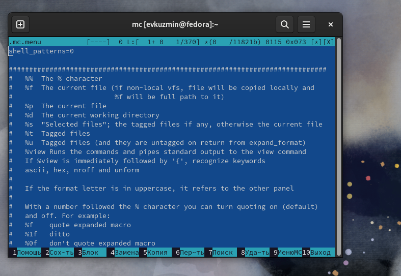{#fig:013 width=70%}

 Из подменю "настройки" вызваю окна "настройки панели" (рис. 14)
 
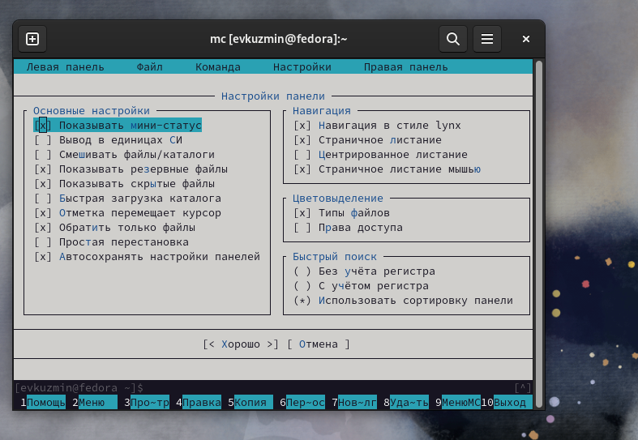{#fig:014 width=70%}

 Вызываю окно "настройки внешнего вида" (рис. 15)

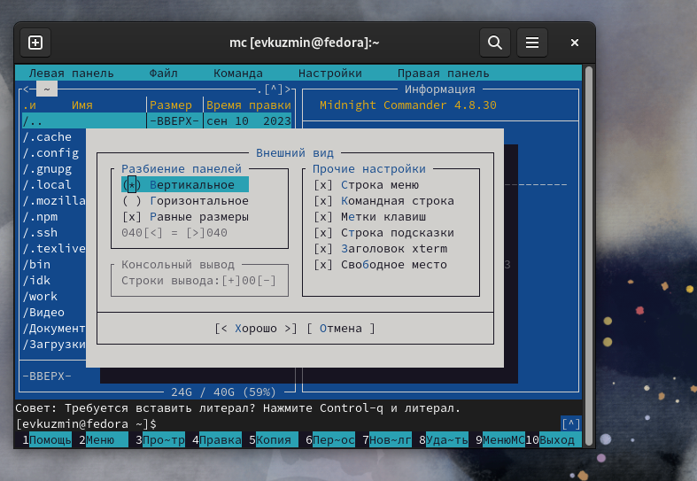{#fig:015 width=70%}

 Командой touch text.txt создала файл (рис. 16).

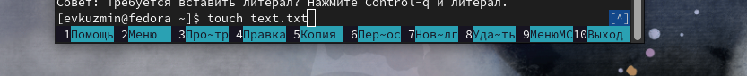{#fig:016 width=70%}

 Клавишей F4 открываю файл для записи, добавляю в него текст (рис. 17).

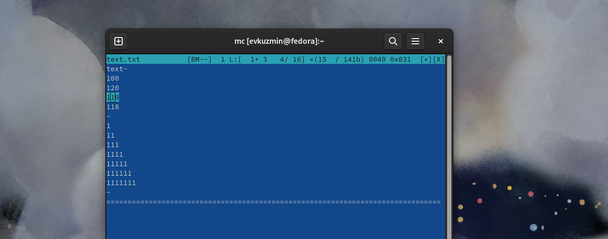{#fig:017 width=70%}

 Выделяю текст кликами мыши, делаю блок через F3, перемещаю выделенный текст с помощью клавиши F6  (рис. 18).

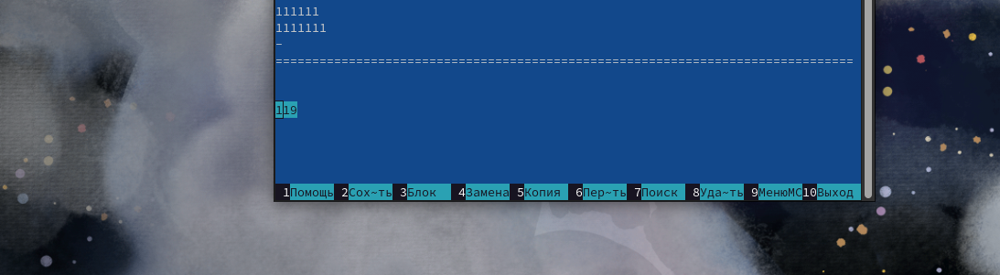{#fig:018 width=70%}

 Удалиляю строку текста с помощью ctrl+y  (рис. 19).

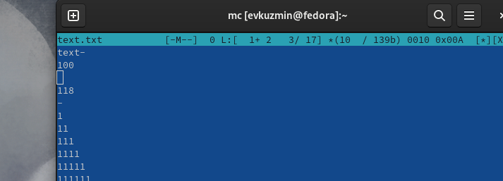{#fig:019 width=70%}

 Сохраняю изменения в файле с помощью горячей клавиши F2  (рис. 20).

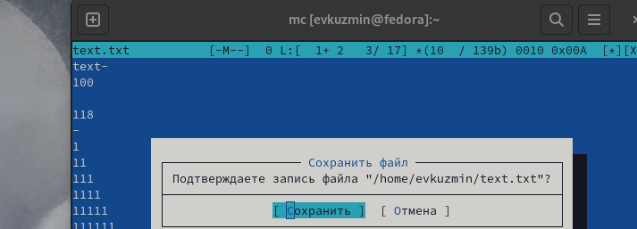{#fig:020 width=70%}

 С помощью ctrl+u отменяю поседнее действие и возвращаю удаленную строку  (рис. 21).

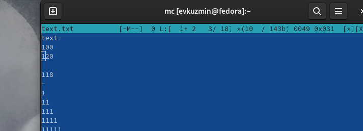{#fig:021 width=70%}

 С помощью клавиш pgup, pgdn, у меня получилось попасть в начало и в конец файла соответственно, я добавил текст в начало и в конец файла  (рис. 22).

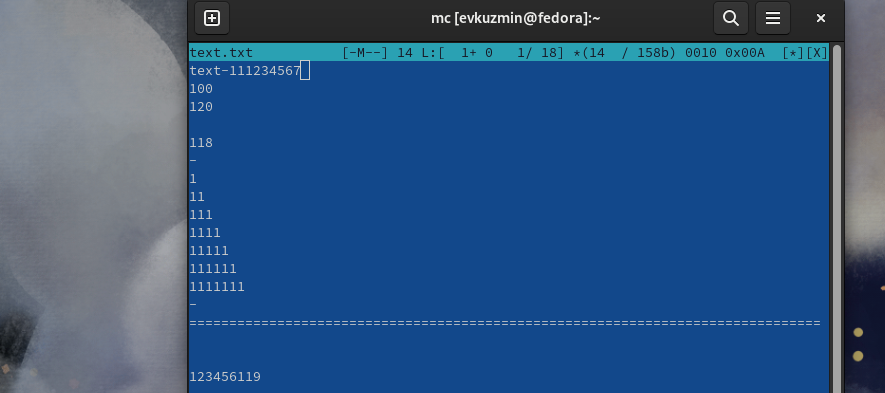{#fig:022 width=70%}

 Закрываю файл, сохраняя изменения (рис. 23).
 
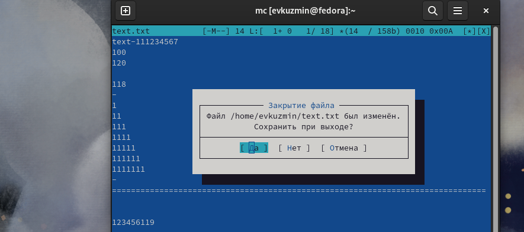{#fig:023 width=70%}

 Открываю файл, написанный на ассемблере, всё прекрасно просматривается (рис. 24).
 
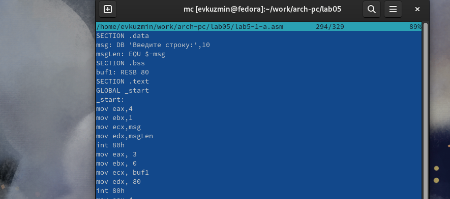{#fig:024 width=70%}

 Подключаю подсветку через горячие клавиши (рис. 25).

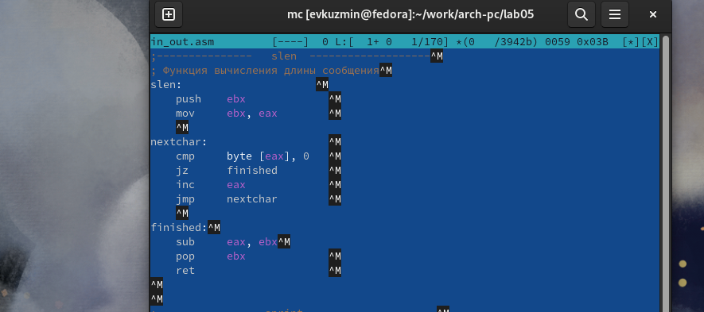{#fig:025 width=70%}

# Выводы

 При выполнениии данной лабораторной работы я освоил основные возможности командной оболочки Midnight Commander, приобрел навыки практической работы по просмотру каталогов и файлов

# Ответы на контрольные вопросы

1. Какие режимы работы есть в mc. Охарактеризуйте их. Панели могут дополнительно быть переведены в один из двух режимов: Информация или Дерево. В режиме Информация на панель выводятся сведения о файле и текущей файловой системе, расположенных на активной панели. В режиме Дерево (рис. 7.3) на одной из панелей выводится структура дерева каталогов.

2. Какие операции с файлами можно выполнить как с помощью команд shell, так и с помощью меню (комбинаций клавиш) mc? Приведите несколько примеров. В разделе Командная строка оболочки (Shell) перечисляются команды и комбинации клавиш, которые используются для ввода и редактирования команд в командной строке оболочки. Большая часть этих команд служит для переноса имен файлов и/или имен каталогов в командную строку (чтобы уменьшить трудоемкость ввода) или для доступа к истории команд. Клавиши редактирования строк ввода используются как при редактировании командной строки, так и других строк ввода, появляющихся в различных запросах программы.

Как с помощью меню так и с помощью команд shell можно переносить, копировать и получать информацию о файоах и каталогах.

3. Опишите структура меню левой (или правой) панели mc, дайте характеристику командам.

В меню каждой (левой или правой) панели можно выбрать Формат списка:
- стандартный — выводит список файлов и каталогов с указанием размера и времени правки;
- ускоренный — позволяет задать число столбцов, на которые разбивается панель при выводе списка имён файлов или каталогов без дополнительной информации;
- расширенный — помимо названия файла или каталога выводит сведения о правах доступа, владельце, группе, размере, времени правки;
- определённый пользователем — позволяет вывести те сведения о файле или каталоге, которые задаст сам пользователь.

4. Опишите структура меню Файл mc, дайте характеристику командам.
В меню Файл содержит перечень команд, которые могут быть применены к одному или нескольким файлам или каталогам.

Команды меню Файл:
  - Просмотр ( F3 ) — позволяет посмотреть содержимое текущего (или выделенного) файла без возможности редактирования.
  - Просмотр вывода команды ( М + ! ) — функция запроса команды с параметрами (аргумент к текущему  выбранному файлу).
  - Правка ( F4 ) — открывает текущий (или выделенный) файл для его редактирования.
  - Копирование ( F5 ) — осуществляет копирование одного или нескольких файлов или каталогов в указанное пользователем во всплывающем окне место.
  - Права доступа ( Ctrl-x c ) — позволяет указать (изменить) права доступа к одному или нескольким файлам или каталогам .
  - Жёсткая ссылка ( Ctrl-x l ) — позволяет создать жёсткую ссылку к текущему (или выделенному) файлу.
  - Символическая ссылка ( Ctrl-x s ) — позволяет создать символическую ссылку к текущему (или выделенному) файлу.
  - Владелец/группа ( Ctrl-x o ) — позволяет задать (изменить) владельца и имя группы для одного или нескольких файлов или каталогов.
  - Права (расширенные) — позволяет изменить права доступа и владения для одного или нескольких файлов или каталогов.
  - Переименование ( F6 ) — позволяет переименовать (или переместить) один или несколько файлов или каталогов.
  - Создание каталога ( F7 ) — позволяет создать каталог.
  - Удалить ( F8 ) — позволяет удалить один или несколько файлов или каталогов.
  - Выход ( F10 ) — завершает работу mc.

5. Опишите структура меню Команда mc, дайте характеристику командам.

В меню Команда содержатся более общие команды для работы с mc. Команды меню Команда:

  - Дерево каталогов — отображает структуру каталогов системы.
  - Поиск файла — выполняет поиск файлов по заданным параметрам.
  - Переставить панели — меняет местами левую и правую панели.
  - Сравнить каталоги ( Ctrl-x d ) — сравнивает содержимое двух каталогов.
  - Размеры каталогов — отображает размер и время изменения каталога (по умолчанию в mc размер - каталога корректно не отображается).
  - История командной строки — выводит на экран список ранее выполненных в оболочке команд.
  - Каталоги быстрого доступа ( Ctrl-\ ) — пр вызове выполняется быстрая смена текущего каталога на один из заданного списка.
  - Восстановление файлов — позволяет восстановить файлы на файловых системах ext2 и ext3.
  - Редактировать файл расширений — позволяет задать с помощью определённого синтаксиса действия при запуске файлов с определённым расширением (например, какое программного обеспечение запускать для открытия или редактирования файлов с расширением doc или docx).
  - Редактировать файл меню — позволяет отредактировать контекстное меню пользователя, вызываемое по клавише F2 .
  - Редактировать файл расцветки имён — позволяет подобрать оптимальную для пользователя расцветку имён файлов в зависимости от их типа.

6. Опишите структура меню Настройки mc, дайте характеристику командам.

Меню Настройки содержит ряд дополнительных опций по внешнему виду и функциональности mc. Меню Настройки содержит:
  - Конфигурация — позволяет скорректировать настройки работы с панелями.
  - Внешний вид и Настройки панелей — определяет элементы (строка меню, командная строка, подсказки и прочее), отображаемые при вызове mc, а также геометрию расположения панелей и цветовыделение.
  - Биты символов — задаёт формат обработки информации локальным терминалом.
  - Подтверждение — позволяет установить или убрать вывод окна с запросом подтверждения действий при операциях удаления и перезаписи файлов, а также при выходе из программы.
  - Распознание клавиш — диалоговое окно используется для тестирования функциональных клавиш, клавиш управления курсором и прочее.
  - Виртуальные ФС –– настройки виртуальной файловой системы: тайм-аут, пароль и прочее.

7. Назовите и дайте характеристику встроенным командам mc.

    - F1 Вызов контекстно-зависимой подсказки;
    - F2 Вызов пользовательского меню с возможностью создания и/или дополнения дополнительных функций;
    - F3 Просмотр содержимого файла, на который указывает подсветка в активной панели (без возможности редактирования);
    - F4 Вызов встроенного в mc редактора для изменения содержания файла, на который указывает подсветка в активной панели;
    - F5 Копирование одного или нескольких файлов, отмеченных в первой (активной) панели, в каталог, отображаемый на второй панели;
    - F6 Перенос одного или нескольких файлов, отмеченных в первой (активной) панели, в каталог, отображаемый на второй панели;
    - F7 Создание подкаталога в каталоге, отображаемом в активной панели;
    - F8 Удаление одного или нескольких файлов (каталогов), отмеченных в первой (активной) панели файлов;
    - F9 Вызов меню mc;
    - F10 Выход из mc;

8. Назовите и дайте характеристику командам встроенного редактора mc.
    - Ctrl-y удалить строку;
    - Ctrl-u отмена последней операции; Ins вставка/замена;
    - F7 поиск (можно использовать регулярные выражения);
    - (стрелочка вверх)-F7 повтор последней операции поиска;
    - F4 замена;
    - F3 первое нажатие — начало выделения,
    - второе — окончание выделения;
    - F5 копировать выделенный фрагмент;
    - F6 переместить выделенный фрагмент;
    - F8 удалить выделенный фрагмент;
    - F2 записать изменения в файл;
    - F10 выйти из редактора.

9. Дайте характеристику средствам mc, которые позволяют создавать меню, определяемые пользователем.

Можете сохранить часто используемые команды панелизации под отдельными информативными именами, чтобы иметь возможность их быстро вызвать по этим именам. Для этого нужно набрать команду в строке ввода (строка "Команда") и нажать кнопку Добавить. После этого потребуется ввести имя, по которому мы будем вызывать команду. В следующий раз вам достаточно будет выбрать нужное имя из списка, а не вводить всю команду заново.

10. Дайте характеристику средствам mc, которые позволяют выполнять действия, определяемые пользователем, над текущим файлом.

Панель в mc отображает список файлов текущего каталога. Абсолютный путь к этому каталогу отображается в заголовке панели. У активной панели заголовок и одна из её строк подсвечиваются. Управление панелями осуществляется с помощью определённых комбинаций клавиш или пунктов меню mc.

## Список литературы{.unnumbered}

[Архитектура компьютеров и ОС/Электронный ресурс](https://esystem.rudn.ru/mod/page/view.php?id=1098787)
