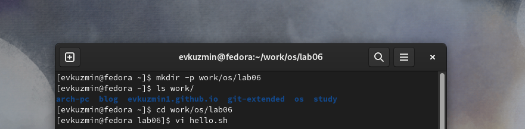
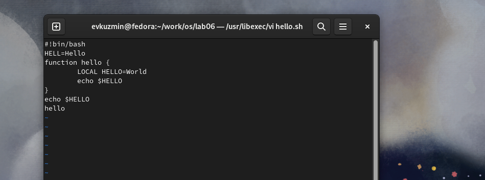
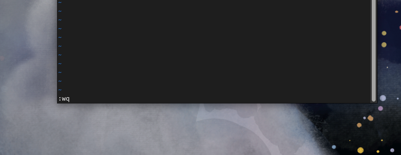
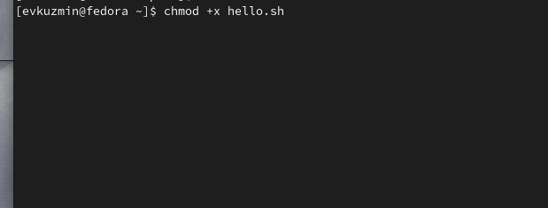
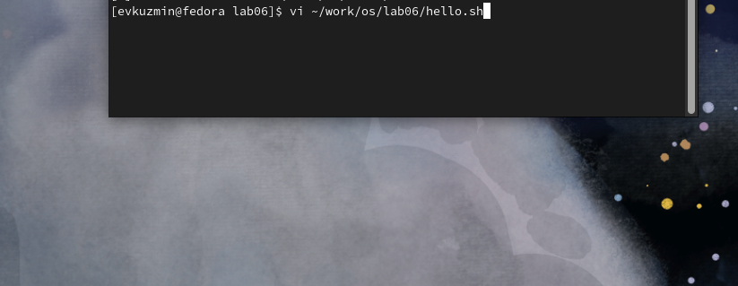
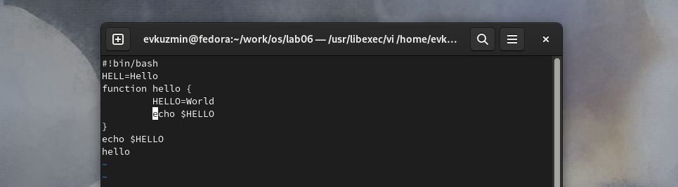
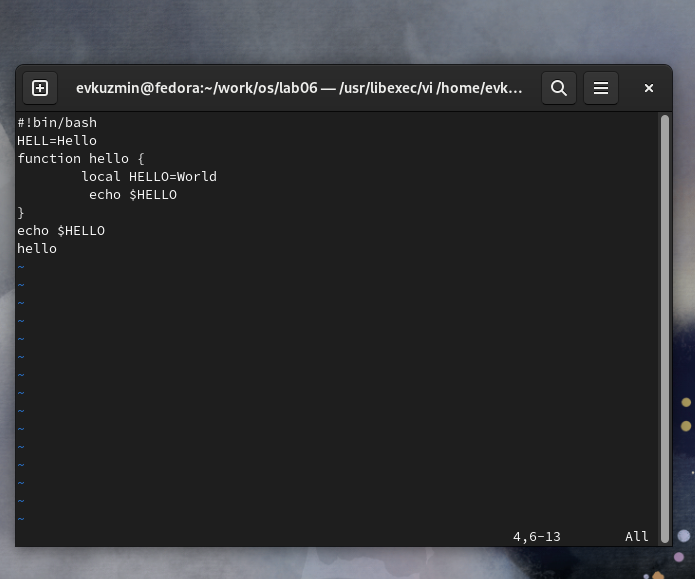
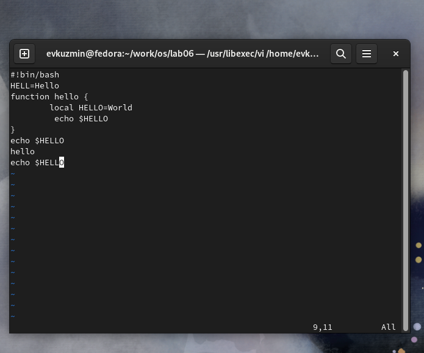

---
## Front matter
lang: ru-RU
title: Лабораторная работа №8
subtitle: Операционные системы
author:
  - Кузьмин Егор Витальевич, НКАбд-03-23
institute:
  - Российский университет дружбы народов, Москва, Россия

date: 13 апреля 2024

## i18n babel
babel-lang: russian
babel-otherlangs: english

## Formatting pdf
toc: false
toc-title: Содержание
slide_level: 2
aspectratio: 169
section-titles: true
theme: metropolis
header-includes:
 - \metroset{progressbar=frametitle,sectionpage=progressbar,numbering=fraction}
 - '\makeatletter'
 - '\beamer@ignorenonframefalse'
 - '\makeatother'
 
## font
mainfont: PT Serif
romanfont: PT Serif
sansfont: PT Sans
monofont: PT Mono
mainfontoptions: Ligatures=TeX
romanfontoptions: Ligatures=TeX
sansfontoptions: Ligatures=TeX,Scale=MatchLowercase
monofontoptions: Scale=MatchLowercase,Scale=0.9
---
---

## Цель работы

 Целью данной лабораторной работы является знакомство с операционной системой Linux, получить практические навыки работы с редактором vi, установленным по умолчанию практически во всех дистрибутивах.

## Задание

 0. Ознакомиться с техническими материалами
 1. Ознакомиться с теоретическим материалом.
 2. Ознакомиться с редактором vi.
 3. Выполнить упражнения, используя команды vi.

## Выполнение лабораторной работы

 Создаю директорию, в которой буду работать, с помощью команды mkdir, создаю и открываю для редактирования файл с помощью встроенного текстового редактора vi

## Выполнение лабораторной работы

 Нажимаю i, чтобы начать редактирование и добавляться текст (режим добавления), далее добавляю текст.

## Выполнение лабораторной работы

 Нажимаю esc, чтобы выйти из режима добавления и перейти в командный режим. Перехожу в режим последней строки.

## Выполнение лабораторной работы

 С помощью chmod добавляю права на исполнение файла, делая его исполняемым.

## Выполнение лабораторной работы

 Снова открываю этот файл с помощью текстового редактора vi.

## Выполнение лабораторной работы

 Изменяю местоположение курсора.

## Выполнение лабораторной работы

 В режиме добавления (клавиша i) удаляю слово LOCAL, снова перехожу в командный режим с помощью esc.

## Выполнение лабораторной работы

 Затем я перехожу в конец последней строки и добавляю новую строку, снова перехожу в командный режим с помощью esc. 

{#fig:008 width=70%}

## Выполнение лабораторной работы

 Удаляю вписанную строку, но потом в командном режиме я нажимаю "u" и отменяю последнее действие - удаление строки.

## Выводы

 При выполнении данной лабораторной работы я получил практические навыки работы с редактором vi, установленным по умолчанию практически во всех дистрибутивах.

