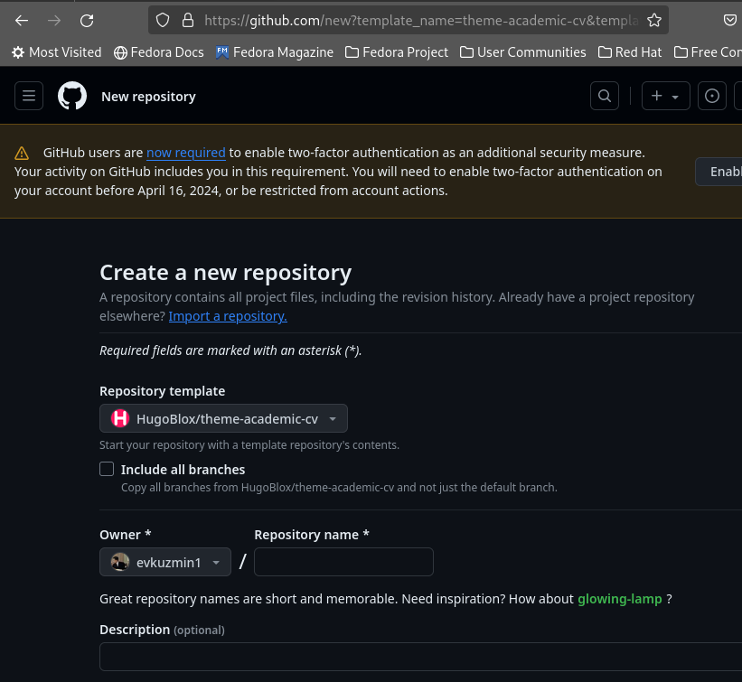
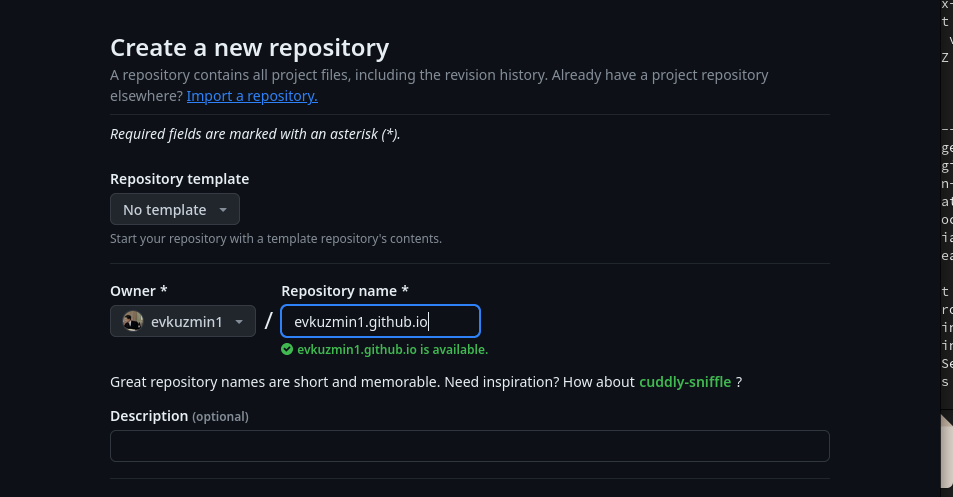
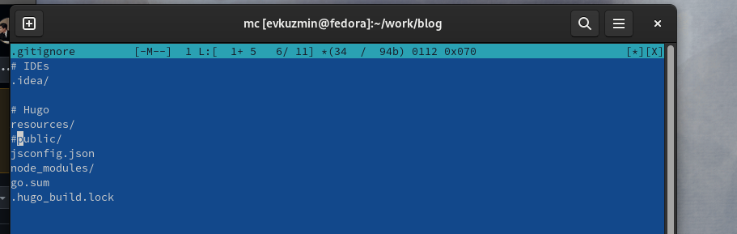
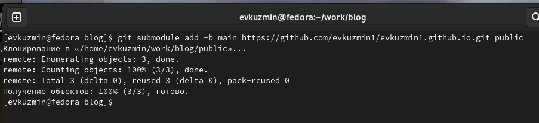
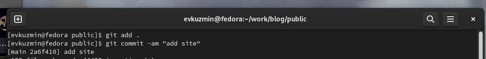

---
## Front matter
lang: ru-RU
title: Первый этап индивидуального проекта
subtitle: Операционные системы
author:
  - Кузьмин Е. В.
institute:
  - Российский университет дружбы народов, Москва, Россия
date: 1 марта 2023

## i18n babel
babel-lang: russian
babel-otherlangs: english

## Formatting pdf
toc: false
toc-title: Содержание
slide_level: 2
aspectratio: 169
section-titles: true
theme: metropolis
header-includes:
 - \metroset{progressbar=frametitle,sectionpage=progressbar,numbering=fraction}
 - '\makeatletter'
 - '\beamer@ignorenonframefalse'
 - '\makeatother'
 
## font
mainfont: PT Serif
romanfont: PT Serif
sansfont: PT Sans
monofont: PT Mono
mainfontoptions: Ligatures=TeX
romanfontoptions: Ligatures=TeX
sansfontoptions: Ligatures=TeX,Scale=MatchLowercase
monofontoptions: Scale=MatchLowercase,Scale=0.9
---

# Элементы презентации

## Актуальность

Научному работнику полезно иметь сайт-портфолио про него и его проекты.

## Цели и задачи

 0. Ознакомление с заданием и необходимым ПО
 1. Установка необходимого ПО
 2. Скачать шаблон темы сайта 
 3. Разместить результат на хостинге Git
 4. Установить параметр для URL's сайта 
 5. Разместить заготовку сайта на хостинге Github pages

## ПО и методы

-hugo
-Github
-git
-Github pages

## Содержание исследования

 Создаю свой репозиторий blog (рис. 1).

## Выполнение первого этапа проекта

 Получаем страницу сайта на локальном сервере (рис. 2).

## Установка параметр для URLs сайта

 Создаю новый пустой репозиторий, чье имя будет адресом сайта (рис. 3).

## Установка параметр для URLs сайта

 Перед тем как подключать созданный пустой репозиторйи к каталогу public из репозитория blog, нужно отключить в файле gitignore publiс (рис. 4).

## Установка параметр для URLs сайта

 Подключаю репозиторий к каталогу public (рис. 5).

## Размещение заготовку сайта на Github pages.

 Проверяю есть ли подключение между public и репозиторием emkurilkoryumin.github.io, после чего отправляю изменения на глобальный репозиторий (рис. 6).

## Результаты

-Научился размещать сайт на Github pages
-Разместил шаблон сайта на сервере

#Спасибо за внимание

