---
## Front matter
title: "Отчет по третьему этапу индивидуального проекта"
subtitle: "Операционные системы"
author: "Кузьмин Егор Витальевич"

## Generic otions
lang: ru-RU
toc-title: "Содержание"

## Bibliography
bibliography: bib/cite.bib
csl: pandoc/csl/gost-r-7-0-5-2008-numeric.csl

## Pdf output format
toc: true # Table of contents
toc-depth: 2
lof: true # List of figures
lot: true # List of tables
fontsize: 12pt
linestretch: 1.5
papersize: a4
documentclass: scrreprt
## I18n polyglossia
polyglossia-lang:
  name: russian
  options:
	- spelling=modern
	- babelshorthands=true
polyglossia-otherlangs:
  name: english
## I18n babel
babel-lang: russian
babel-otherlangs: english
## Fonts
mainfont: PT Serif
romanfont: PT Serif
sansfont: PT Sans
monofont: PT Mono
mainfontoptions: Ligatures=TeX
romanfontoptions: Ligatures=TeX
sansfontoptions: Ligatures=TeX,Scale=MatchLowercase
monofontoptions: Scale=MatchLowercase,Scale=0.9
## Biblatex
biblatex: true
biblio-style: "gost-numeric"
biblatexoptions:
  - parentracker=true
  - backend=biber
  - hyperref=auto
  - language=auto
  - autolang=other*
  - citestyle=gost-numeric
## Pandoc-crossref LaTeX customization
figureTitle: "Рис."
tableTitle: "Таблица"
listingTitle: "Листинг"
lofTitle: "Список иллюстраций"
lotTitle: "Список таблиц"
lolTitle: "Листинги"
## Misc options
indent: true
header-includes:
  - \usepackage{indentfirst}
  - \usepackage{float} # keep figures where there are in the text
  - \floatplacement{figure}{H} # keep figures where there are in the text
---

# Цель работы

 Продолжить работу с сайтом, теперь нужно добавить личную информацию, пару постов

# Задание

 0. Ознакомиться с заданием и нюансами.
 1. Добавить информацию о навыках (Skills).
 2. Добавить информацию об опыте (Experience).
 3. Добавить информацию о достижениях (Accomplishments).
 4. Сделать пост по прошедшей неделе.
 5. Добавить пост на тему по выбору.

# Теоретическое введение

 Hugo — генератор статических страниц для интернета.

 Немного о статистических сайтах:
  
    1. Статические сайты состоят из уже готовых HTML-страниц.
    2. Эти страницы собираются заранее, а не готовятся для пользователя «на лету». Для этого используют генераторы статичных сайтов.
    3. Так как это почти чистый HTML, то такие сайты быстрее загружаются и их проще переносить с сервера на сервер.
    4. Минус: если нужно что-то обновить на странице, то сначала это правят в исходном файле, а потом запускают обновление в генераторе.
    5. Ещё минус: такие страницы не подходят для интернет-магазинов или сайтов с личным кабинетом, потому что в статике нельзя сформировать страницу для каждого отдельного пользователя.

# Выполнение проекта

 Захожу в терминал, перехожу в директорию ~/work/blog, ввожу команду ~/bin/hugo server для запуска локального сервера (рис. 1)

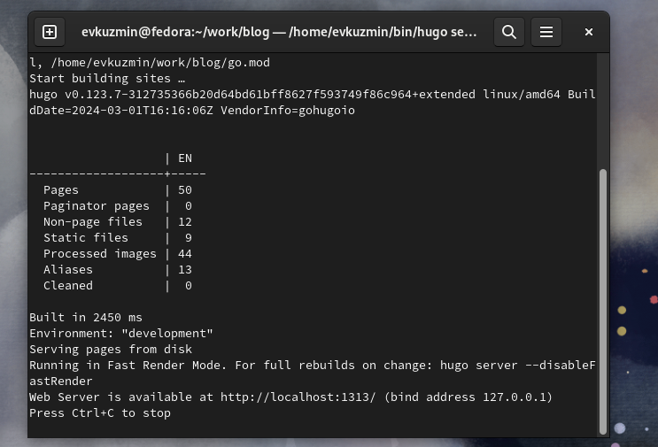{#fig:001 width=70%}

 Перехожу в директорию ~/work/blog/content/authors/admin, открываю файл _index.md, его я буду редактировать далее. В разделе "Skills" прописываю свои навыки. Иконки поставил, найдя в интернете официальную библиотеку fas (рис. 2)

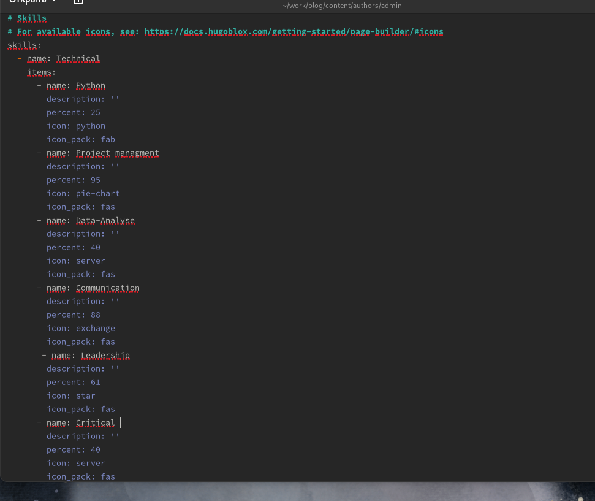{#fig:002 width=70%}

 Изменяю раздел с моими увлечениями (рис. 3)

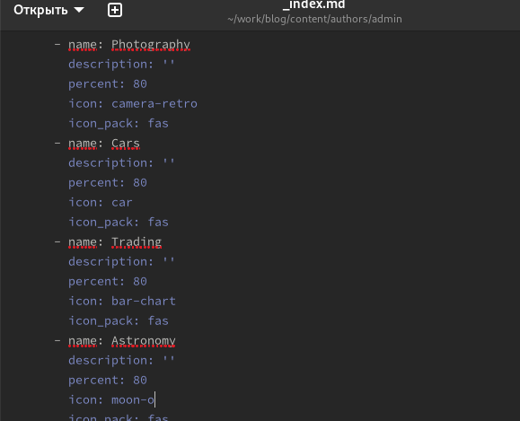{#fig:003 width=70%}

 Проверяю, есть ли изменения на сайте (рис. 4)

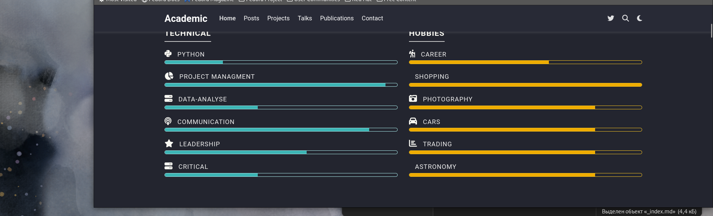{#fig:004 width=70%}

 Далее добавляю свой опыт в блоке Experience, указав название компании, в которой получил опыт работы, добавил даты, поменял иконки (рис. 5)

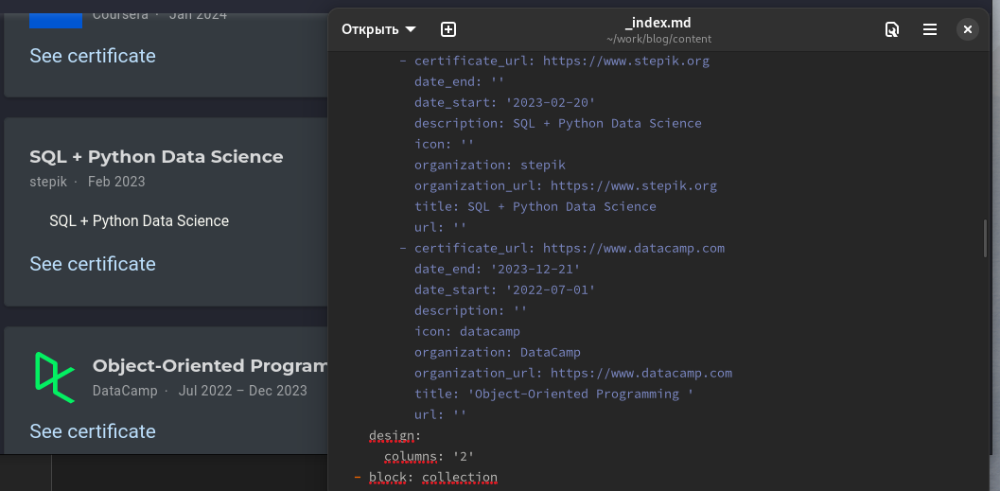{#fig:005 width=70%}

 Чтобы корректно отображались иконки компаний, нужно скачать изображения из интернета в формате svg и перенести в необходимую директорию (рис. 6)

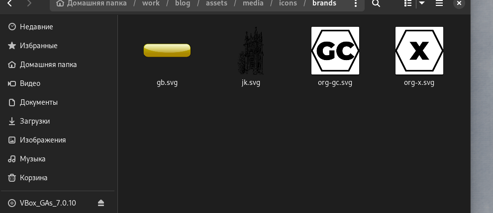{#fig:006 width=70%}

 Добавил пост на тему по выбору - легкословесные языки разметки, изменив файл index в соответствующей папке (рис. 7)

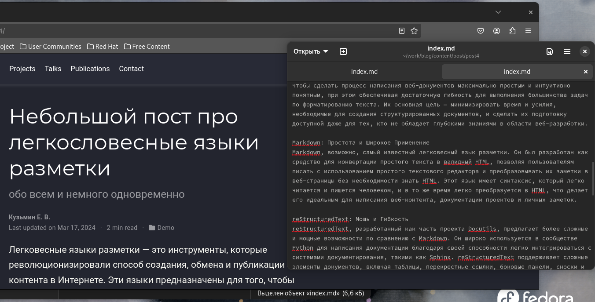{#fig:007 width=70%}

 Добавил пост по прошедшим 5 дням в той же папке (рис. 8)

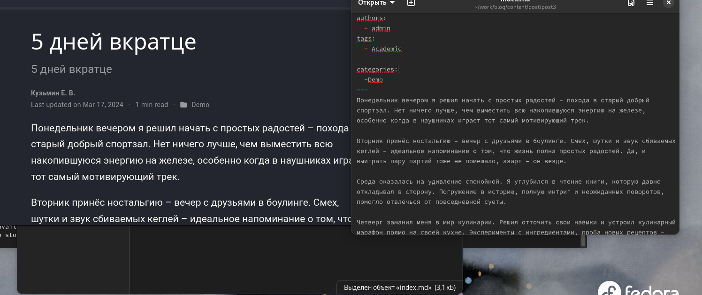{#fig:008 width=70%}

 Закрываю локальный сервер с помощью клавиш Ctrl+C и собираю сайт с изменениями, введя команду ~/bin/hugo без аргументов (рис. 9)

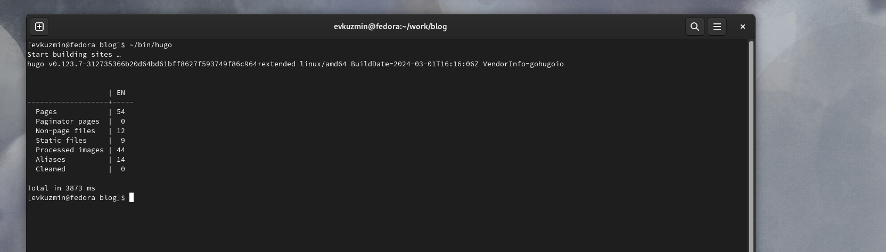{#fig:009 width=70%}

 Отправляю изменения на GitHub (рис. 10)

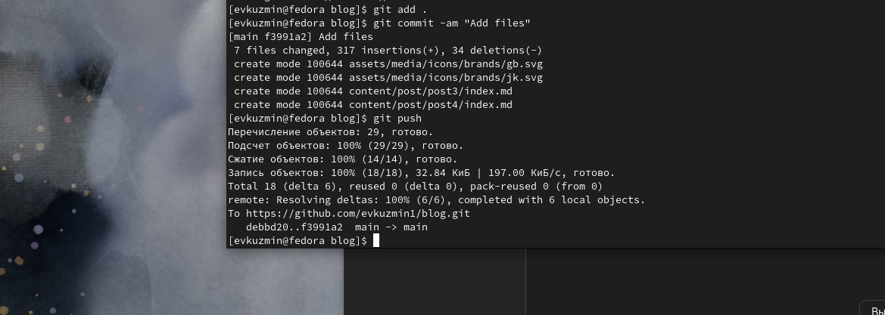{#fig:010 width=70%}

 Перехожу в директорию blog/public и отправляю изменения на GitHub, чтобы глобальный сайт тоже был обновлен (рис. 11)

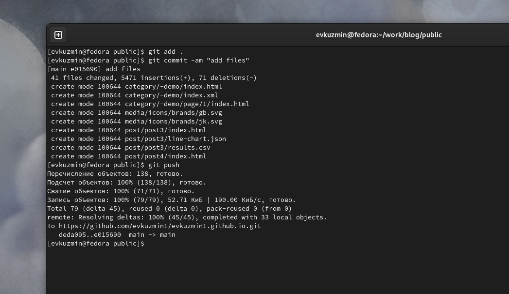{#fig:011 width=70%}

 Проверяю, что все сделано корректно (рис. 12)

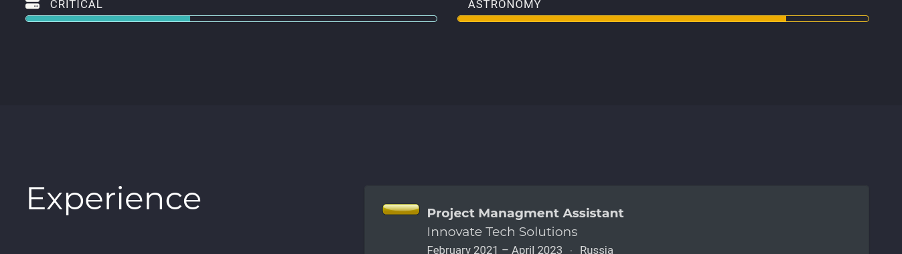{#fig:012 width=70%}

# Выводы

 В процессе выполнения второго этапа индивидуального проекта я научился редактировать личные данные, написал несколько постов и добавил все изменения на сайт.
 
# Список литературы{.unnumbered}

[Архитектура компьютеров и ОС/Электронный ресурс](https://esystem.rudn.ru/mod/page/view.php?id=1098787)

